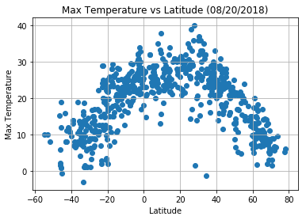
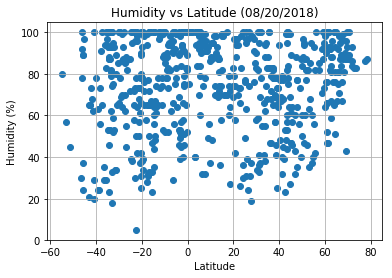
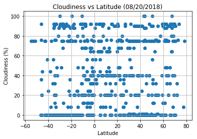
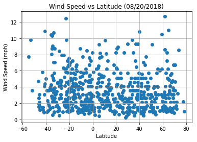

## Overview and Analysis

Observation 1: From the results of this data in "Max Temp vs Lat" Plot, we can see the city temperatures gradually increase and decrease as we go from South Pole to the North Pole.  Of course, as expected, the highest recorded temperature are concentrated near or at the equator.  However, it is interesting that the maxium temperatures recorded on this date are in cities that are just a bit away from the equator (both north and south side).

Observation 2: It is also interesting that there are colder temperatures recorded in cities close to the South Pole compared to the cities closer to the North Pole.
This is probably because the seasons are reversed below the equator.  Right now it is summer in the Northern Hemisphere, but winter in the Southern hemisphiere (close to Antarctica)

Observation 3: It seems that there is more humidity in cities closer to the equator.  Not a drastic difference, but still significant.  However, there seems no correlation between cloudiness and the latitude, the plot has pretty even distribution.   Same goes for windspeed.  

Observation 4: It would be interesting to see these figures in different seasons (Spring, Summer, Autumn and Winter), so we can observe if the above findings are different.
It would also be good to compare this data to previous years, to see the climate change at different latitudes.


```python
from citipy import citipy
import random
import matplotlib.pyplot as plt
import openweathermapy as ow
import pandas as pd
from config import api_key
```

## Generate List of Cities


```python

cities = []
samplesize = 700

def generate_cities(sample_size):
    i = 0
    while(i < samplesize):
        if i < (samplesize/4) :
            lat = (random.randint(-90,0)) + (random.randint(0,10)/10) + (random.randint(0,10)/100) 
            lon = (random.randint(-180,0)) + (random.randint(0,10)/10) + (random.randint(0,10)/100)
        elif i < (samplesize/2):
            lat = (random.randint(0,90)) + (random.randint(0,10)/10) + (random.randint(0,10)/100) 
            lon = (random.randint(-180,0)) + (random.randint(0,10)/10) + (random.randint(0,10)/100)
        elif i < (samplesize*(3/4)):
            lat = (random.randint(-90,0)) + (random.randint(0,10)/10) + (random.randint(0,10)/100) 
            lon = (random.randint(0,180)) + (random.randint(0,10)/10) + (random.randint(0,10)/100)
        else:
            lat = (random.randint(0,90)) + (random.randint(0,10)/10) + (random.randint(0,10)/100) 
            lon = (random.randint(0,180)) + (random.randint(0,10)/10) + (random.randint(0,10)/100)
        city = citipy.nearest_city(lat, lon)
        cityname = city.city_name
        if (not(cityname in cities)):
            cities.append(cityname)
            i = i + 1


generate_cities(samplesize)
```

## Make API Calls 


```python
weather_data = []
counter = 1
settings = {"units": "metric", "appid": api_key}
url = "http://api.openweathermap.org/data/2.5/weather?"
units = "metric"
for city in cities:    
    print(f"Processing city {counter} of {samplesize} | {city}")
    cityjoined = "_".join(city.split())
    counter = counter + 1
    try:
        weather_data.append(ow.get_current(city, **settings))
        query_url = f"{url}appid={api_key}&q={cityjoined}&units={units}"
        print(query_url)
    except:
        print(f"Data for {city} not found.")
        

```

    Processing city 1 of 700 | mizque
    http://api.openweathermap.org/data/2.5/weather?appid=a9f94bf7dbe3fe0f5d20cb652197fe09&q=mizque&units=metric
    Processing city 2 of 700 | ushuaia
    http://api.openweathermap.org/data/2.5/weather?appid=a9f94bf7dbe3fe0f5d20cb652197fe09&q=ushuaia&units=metric
    Processing city 3 of 700 | mar del plata
    http://api.openweathermap.org/data/2.5/weather?appid=a9f94bf7dbe3fe0f5d20cb652197fe09&q=mar_del_plata&units=metric
    Processing city 4 of 700 | mataura
    http://api.openweathermap.org/data/2.5/weather?appid=a9f94bf7dbe3fe0f5d20cb652197fe09&q=mataura&units=metric
    Processing city 5 of 700 | vaini
    http://api.openweathermap.org/data/2.5/weather?appid=a9f94bf7dbe3fe0f5d20cb652197fe09&q=vaini&units=metric
    Processing city 6 of 700 | arraial do cabo
    http://api.openweathermap.org/data/2.5/weather?appid=a9f94bf7dbe3fe0f5d20cb652197fe09&q=arraial_do_cabo&units=metric
    Processing city 7 of 700 | jamestown
    http://api.openweathermap.org/data/2.5/weather?appid=a9f94bf7dbe3fe0f5d20cb652197fe09&q=jamestown&units=metric
    Processing city 8 of 700 | rikitea
    http://api.openweathermap.org/data/2.5/weather?appid=a9f94bf7dbe3fe0f5d20cb652197fe09&q=rikitea&units=metric
    Processing city 9 of 700 | chuy
    http://api.openweathermap.org/data/2.5/weather?appid=a9f94bf7dbe3fe0f5d20cb652197fe09&q=chuy&units=metric
    Processing city 10 of 700 | marcona
    Data for marcona not found.
    Processing city 11 of 700 | atuona
    http://api.openweathermap.org/data/2.5/weather?appid=a9f94bf7dbe3fe0f5d20cb652197fe09&q=atuona&units=metric
    Processing city 12 of 700 | puerto ayora
    http://api.openweathermap.org/data/2.5/weather?appid=a9f94bf7dbe3fe0f5d20cb652197fe09&q=puerto_ayora&units=metric
    Processing city 13 of 700 | avarua
    http://api.openweathermap.org/data/2.5/weather?appid=a9f94bf7dbe3fe0f5d20cb652197fe09&q=avarua&units=metric
    Processing city 14 of 700 | faanui
    http://api.openweathermap.org/data/2.5/weather?appid=a9f94bf7dbe3fe0f5d20cb652197fe09&q=faanui&units=metric
    Processing city 15 of 700 | punta arenas
    http://api.openweathermap.org/data/2.5/weather?appid=a9f94bf7dbe3fe0f5d20cb652197fe09&q=punta_arenas&units=metric
    Processing city 16 of 700 | sousa
    http://api.openweathermap.org/data/2.5/weather?appid=a9f94bf7dbe3fe0f5d20cb652197fe09&q=sousa&units=metric
    Processing city 17 of 700 | laguna
    http://api.openweathermap.org/data/2.5/weather?appid=a9f94bf7dbe3fe0f5d20cb652197fe09&q=laguna&units=metric
    Processing city 18 of 700 | halalo
    Data for halalo not found.
    Processing city 19 of 700 | sao joao da barra
    http://api.openweathermap.org/data/2.5/weather?appid=a9f94bf7dbe3fe0f5d20cb652197fe09&q=sao_joao_da_barra&units=metric
    Processing city 20 of 700 | coihueco
    http://api.openweathermap.org/data/2.5/weather?appid=a9f94bf7dbe3fe0f5d20cb652197fe09&q=coihueco&units=metric
    Processing city 21 of 700 | saleaula
    Data for saleaula not found.
    Processing city 22 of 700 | ancud
    http://api.openweathermap.org/data/2.5/weather?appid=a9f94bf7dbe3fe0f5d20cb652197fe09&q=ancud&units=metric
    Processing city 23 of 700 | castro
    http://api.openweathermap.org/data/2.5/weather?appid=a9f94bf7dbe3fe0f5d20cb652197fe09&q=castro&units=metric
    Processing city 24 of 700 | buchanan
    http://api.openweathermap.org/data/2.5/weather?appid=a9f94bf7dbe3fe0f5d20cb652197fe09&q=buchanan&units=metric
    Processing city 25 of 700 | avera
    http://api.openweathermap.org/data/2.5/weather?appid=a9f94bf7dbe3fe0f5d20cb652197fe09&q=avera&units=metric
    Processing city 26 of 700 | general roca
    http://api.openweathermap.org/data/2.5/weather?appid=a9f94bf7dbe3fe0f5d20cb652197fe09&q=general_roca&units=metric
    Processing city 27 of 700 | lebu
    http://api.openweathermap.org/data/2.5/weather?appid=a9f94bf7dbe3fe0f5d20cb652197fe09&q=lebu&units=metric
    Processing city 28 of 700 | sataua
    Data for sataua not found.
    Processing city 29 of 700 | taltal
    http://api.openweathermap.org/data/2.5/weather?appid=a9f94bf7dbe3fe0f5d20cb652197fe09&q=taltal&units=metric
    Processing city 30 of 700 | puerto varas
    http://api.openweathermap.org/data/2.5/weather?appid=a9f94bf7dbe3fe0f5d20cb652197fe09&q=puerto_varas&units=metric
    Processing city 31 of 700 | georgetown
    http://api.openweathermap.org/data/2.5/weather?appid=a9f94bf7dbe3fe0f5d20cb652197fe09&q=georgetown&units=metric
    Processing city 32 of 700 | rocha
    http://api.openweathermap.org/data/2.5/weather?appid=a9f94bf7dbe3fe0f5d20cb652197fe09&q=rocha&units=metric
    Processing city 33 of 700 | hermanus
    http://api.openweathermap.org/data/2.5/weather?appid=a9f94bf7dbe3fe0f5d20cb652197fe09&q=hermanus&units=metric
    Processing city 34 of 700 | cidreira
    http://api.openweathermap.org/data/2.5/weather?appid=a9f94bf7dbe3fe0f5d20cb652197fe09&q=cidreira&units=metric
    Processing city 35 of 700 | san pedro
    http://api.openweathermap.org/data/2.5/weather?appid=a9f94bf7dbe3fe0f5d20cb652197fe09&q=san_pedro&units=metric
    Processing city 36 of 700 | alenquer
    http://api.openweathermap.org/data/2.5/weather?appid=a9f94bf7dbe3fe0f5d20cb652197fe09&q=alenquer&units=metric
    Processing city 37 of 700 | paijan
    http://api.openweathermap.org/data/2.5/weather?appid=a9f94bf7dbe3fe0f5d20cb652197fe09&q=paijan&units=metric
    Processing city 38 of 700 | cape town
    http://api.openweathermap.org/data/2.5/weather?appid=a9f94bf7dbe3fe0f5d20cb652197fe09&q=cape_town&units=metric
    Processing city 39 of 700 | uyuni
    http://api.openweathermap.org/data/2.5/weather?appid=a9f94bf7dbe3fe0f5d20cb652197fe09&q=uyuni&units=metric
    Processing city 40 of 700 | corrente
    http://api.openweathermap.org/data/2.5/weather?appid=a9f94bf7dbe3fe0f5d20cb652197fe09&q=corrente&units=metric
    Processing city 41 of 700 | touros
    http://api.openweathermap.org/data/2.5/weather?appid=a9f94bf7dbe3fe0f5d20cb652197fe09&q=touros&units=metric
    Processing city 42 of 700 | getulio vargas
    http://api.openweathermap.org/data/2.5/weather?appid=a9f94bf7dbe3fe0f5d20cb652197fe09&q=getulio_vargas&units=metric
    Processing city 43 of 700 | calama
    http://api.openweathermap.org/data/2.5/weather?appid=a9f94bf7dbe3fe0f5d20cb652197fe09&q=calama&units=metric
    Processing city 44 of 700 | samusu
    Data for samusu not found.
    Processing city 45 of 700 | bataipora
    http://api.openweathermap.org/data/2.5/weather?appid=a9f94bf7dbe3fe0f5d20cb652197fe09&q=bataipora&units=metric
    Processing city 46 of 700 | florianopolis
    http://api.openweathermap.org/data/2.5/weather?appid=a9f94bf7dbe3fe0f5d20cb652197fe09&q=florianopolis&units=metric
    Processing city 47 of 700 | samalaeulu
    Data for samalaeulu not found.
    Processing city 48 of 700 | alta floresta
    http://api.openweathermap.org/data/2.5/weather?appid=a9f94bf7dbe3fe0f5d20cb652197fe09&q=alta_floresta&units=metric
    Processing city 49 of 700 | rio formoso
    http://api.openweathermap.org/data/2.5/weather?appid=a9f94bf7dbe3fe0f5d20cb652197fe09&q=rio_formoso&units=metric
    Processing city 50 of 700 | vaitape
    http://api.openweathermap.org/data/2.5/weather?appid=a9f94bf7dbe3fe0f5d20cb652197fe09&q=vaitape&units=metric
    Processing city 51 of 700 | el alto
    http://api.openweathermap.org/data/2.5/weather?appid=a9f94bf7dbe3fe0f5d20cb652197fe09&q=el_alto&units=metric
    Processing city 52 of 700 | maceio
    http://api.openweathermap.org/data/2.5/weather?appid=a9f94bf7dbe3fe0f5d20cb652197fe09&q=maceio&units=metric
    Processing city 53 of 700 | buritis
    http://api.openweathermap.org/data/2.5/weather?appid=a9f94bf7dbe3fe0f5d20cb652197fe09&q=buritis&units=metric
    Processing city 54 of 700 | pisco
    http://api.openweathermap.org/data/2.5/weather?appid=a9f94bf7dbe3fe0f5d20cb652197fe09&q=pisco&units=metric
    Processing city 55 of 700 | saleilua
    Data for saleilua not found.
    Processing city 56 of 700 | rawson
    http://api.openweathermap.org/data/2.5/weather?appid=a9f94bf7dbe3fe0f5d20cb652197fe09&q=rawson&units=metric
    Processing city 57 of 700 | marau
    http://api.openweathermap.org/data/2.5/weather?appid=a9f94bf7dbe3fe0f5d20cb652197fe09&q=marau&units=metric
    Processing city 58 of 700 | necochea
    http://api.openweathermap.org/data/2.5/weather?appid=a9f94bf7dbe3fe0f5d20cb652197fe09&q=necochea&units=metric
    Processing city 59 of 700 | tandil
    http://api.openweathermap.org/data/2.5/weather?appid=a9f94bf7dbe3fe0f5d20cb652197fe09&q=tandil&units=metric
    Processing city 60 of 700 | axim
    http://api.openweathermap.org/data/2.5/weather?appid=a9f94bf7dbe3fe0f5d20cb652197fe09&q=axim&units=metric
    Processing city 61 of 700 | la paz
    http://api.openweathermap.org/data/2.5/weather?appid=a9f94bf7dbe3fe0f5d20cb652197fe09&q=la_paz&units=metric
    Processing city 62 of 700 | vila velha
    http://api.openweathermap.org/data/2.5/weather?appid=a9f94bf7dbe3fe0f5d20cb652197fe09&q=vila_velha&units=metric
    Processing city 63 of 700 | huarmey
    http://api.openweathermap.org/data/2.5/weather?appid=a9f94bf7dbe3fe0f5d20cb652197fe09&q=huarmey&units=metric
    Processing city 64 of 700 | san carlos de bariloche
    http://api.openweathermap.org/data/2.5/weather?appid=a9f94bf7dbe3fe0f5d20cb652197fe09&q=san_carlos_de_bariloche&units=metric
    Processing city 65 of 700 | ipixuna
    http://api.openweathermap.org/data/2.5/weather?appid=a9f94bf7dbe3fe0f5d20cb652197fe09&q=ipixuna&units=metric
    Processing city 66 of 700 | sao felix do xingu
    http://api.openweathermap.org/data/2.5/weather?appid=a9f94bf7dbe3fe0f5d20cb652197fe09&q=sao_felix_do_xingu&units=metric
    Processing city 67 of 700 | resistencia
    http://api.openweathermap.org/data/2.5/weather?appid=a9f94bf7dbe3fe0f5d20cb652197fe09&q=resistencia&units=metric
    Processing city 68 of 700 | pimentel
    http://api.openweathermap.org/data/2.5/weather?appid=a9f94bf7dbe3fe0f5d20cb652197fe09&q=pimentel&units=metric
    Processing city 69 of 700 | nhamunda
    http://api.openweathermap.org/data/2.5/weather?appid=a9f94bf7dbe3fe0f5d20cb652197fe09&q=nhamunda&units=metric
    Processing city 70 of 700 | rio pomba
    http://api.openweathermap.org/data/2.5/weather?appid=a9f94bf7dbe3fe0f5d20cb652197fe09&q=rio_pomba&units=metric
    Processing city 71 of 700 | coquimbo
    http://api.openweathermap.org/data/2.5/weather?appid=a9f94bf7dbe3fe0f5d20cb652197fe09&q=coquimbo&units=metric
    Processing city 72 of 700 | fare
    http://api.openweathermap.org/data/2.5/weather?appid=a9f94bf7dbe3fe0f5d20cb652197fe09&q=fare&units=metric
    Processing city 73 of 700 | barao de melgaco
    http://api.openweathermap.org/data/2.5/weather?appid=a9f94bf7dbe3fe0f5d20cb652197fe09&q=barao_de_melgaco&units=metric
    Processing city 74 of 700 | coihaique
    http://api.openweathermap.org/data/2.5/weather?appid=a9f94bf7dbe3fe0f5d20cb652197fe09&q=coihaique&units=metric
    Processing city 75 of 700 | jardim
    http://api.openweathermap.org/data/2.5/weather?appid=a9f94bf7dbe3fe0f5d20cb652197fe09&q=jardim&units=metric
    Processing city 76 of 700 | san joaquin
    http://api.openweathermap.org/data/2.5/weather?appid=a9f94bf7dbe3fe0f5d20cb652197fe09&q=san_joaquin&units=metric
    Processing city 77 of 700 | manoel urbano
    http://api.openweathermap.org/data/2.5/weather?appid=a9f94bf7dbe3fe0f5d20cb652197fe09&q=manoel_urbano&units=metric
    Processing city 78 of 700 | imbituba
    http://api.openweathermap.org/data/2.5/weather?appid=a9f94bf7dbe3fe0f5d20cb652197fe09&q=imbituba&units=metric
    Processing city 79 of 700 | estreito
    http://api.openweathermap.org/data/2.5/weather?appid=a9f94bf7dbe3fe0f5d20cb652197fe09&q=estreito&units=metric
    Processing city 80 of 700 | lufilufi
    http://api.openweathermap.org/data/2.5/weather?appid=a9f94bf7dbe3fe0f5d20cb652197fe09&q=lufilufi&units=metric
    Processing city 81 of 700 | vaitupu
    Data for vaitupu not found.
    Processing city 82 of 700 | puerto leguizamo
    http://api.openweathermap.org/data/2.5/weather?appid=a9f94bf7dbe3fe0f5d20cb652197fe09&q=puerto_leguizamo&units=metric
    Processing city 83 of 700 | chicama
    http://api.openweathermap.org/data/2.5/weather?appid=a9f94bf7dbe3fe0f5d20cb652197fe09&q=chicama&units=metric
    Processing city 84 of 700 | viedma
    http://api.openweathermap.org/data/2.5/weather?appid=a9f94bf7dbe3fe0f5d20cb652197fe09&q=viedma&units=metric
    Processing city 85 of 700 | contamana
    http://api.openweathermap.org/data/2.5/weather?appid=a9f94bf7dbe3fe0f5d20cb652197fe09&q=contamana&units=metric
    Processing city 86 of 700 | antofagasta
    http://api.openweathermap.org/data/2.5/weather?appid=a9f94bf7dbe3fe0f5d20cb652197fe09&q=antofagasta&units=metric
    Processing city 87 of 700 | sao sebastiao
    http://api.openweathermap.org/data/2.5/weather?appid=a9f94bf7dbe3fe0f5d20cb652197fe09&q=sao_sebastiao&units=metric
    Processing city 88 of 700 | anajatuba
    http://api.openweathermap.org/data/2.5/weather?appid=a9f94bf7dbe3fe0f5d20cb652197fe09&q=anajatuba&units=metric
    Processing city 89 of 700 | alto araguaia
    http://api.openweathermap.org/data/2.5/weather?appid=a9f94bf7dbe3fe0f5d20cb652197fe09&q=alto_araguaia&units=metric
    Processing city 90 of 700 | presidente medici
    http://api.openweathermap.org/data/2.5/weather?appid=a9f94bf7dbe3fe0f5d20cb652197fe09&q=presidente_medici&units=metric
    Processing city 91 of 700 | alofi
    http://api.openweathermap.org/data/2.5/weather?appid=a9f94bf7dbe3fe0f5d20cb652197fe09&q=alofi&units=metric
    Processing city 92 of 700 | chimbote
    http://api.openweathermap.org/data/2.5/weather?appid=a9f94bf7dbe3fe0f5d20cb652197fe09&q=chimbote&units=metric
    Processing city 93 of 700 | constitucion
    http://api.openweathermap.org/data/2.5/weather?appid=a9f94bf7dbe3fe0f5d20cb652197fe09&q=constitucion&units=metric
    Processing city 94 of 700 | ovalle
    http://api.openweathermap.org/data/2.5/weather?appid=a9f94bf7dbe3fe0f5d20cb652197fe09&q=ovalle&units=metric
    Processing city 95 of 700 | belmonte
    http://api.openweathermap.org/data/2.5/weather?appid=a9f94bf7dbe3fe0f5d20cb652197fe09&q=belmonte&units=metric
    Processing city 96 of 700 | diamantino
    http://api.openweathermap.org/data/2.5/weather?appid=a9f94bf7dbe3fe0f5d20cb652197fe09&q=diamantino&units=metric
    Processing city 97 of 700 | nueve de julio
    http://api.openweathermap.org/data/2.5/weather?appid=a9f94bf7dbe3fe0f5d20cb652197fe09&q=nueve_de_julio&units=metric
    Processing city 98 of 700 | tabou
    http://api.openweathermap.org/data/2.5/weather?appid=a9f94bf7dbe3fe0f5d20cb652197fe09&q=tabou&units=metric
    Processing city 99 of 700 | barcelos
    http://api.openweathermap.org/data/2.5/weather?appid=a9f94bf7dbe3fe0f5d20cb652197fe09&q=barcelos&units=metric
    Processing city 100 of 700 | paucartambo
    Data for paucartambo not found.
    Processing city 101 of 700 | tocopilla
    http://api.openweathermap.org/data/2.5/weather?appid=a9f94bf7dbe3fe0f5d20cb652197fe09&q=tocopilla&units=metric
    Processing city 102 of 700 | villazon
    Data for villazon not found.
    Processing city 103 of 700 | sao borja
    http://api.openweathermap.org/data/2.5/weather?appid=a9f94bf7dbe3fe0f5d20cb652197fe09&q=sao_borja&units=metric
    Processing city 104 of 700 | tiarei
    http://api.openweathermap.org/data/2.5/weather?appid=a9f94bf7dbe3fe0f5d20cb652197fe09&q=tiarei&units=metric
    Processing city 105 of 700 | armacao dos buzios
    Data for armacao dos buzios not found.
    Processing city 106 of 700 | coahuayana
    http://api.openweathermap.org/data/2.5/weather?appid=a9f94bf7dbe3fe0f5d20cb652197fe09&q=coahuayana&units=metric
    Processing city 107 of 700 | tartagal
    http://api.openweathermap.org/data/2.5/weather?appid=a9f94bf7dbe3fe0f5d20cb652197fe09&q=tartagal&units=metric
    Processing city 108 of 700 | paragominas
    http://api.openweathermap.org/data/2.5/weather?appid=a9f94bf7dbe3fe0f5d20cb652197fe09&q=paragominas&units=metric
    Processing city 109 of 700 | rio grande
    http://api.openweathermap.org/data/2.5/weather?appid=a9f94bf7dbe3fe0f5d20cb652197fe09&q=rio_grande&units=metric
    Processing city 110 of 700 | mineros
    http://api.openweathermap.org/data/2.5/weather?appid=a9f94bf7dbe3fe0f5d20cb652197fe09&q=mineros&units=metric
    Processing city 111 of 700 | saldanha
    http://api.openweathermap.org/data/2.5/weather?appid=a9f94bf7dbe3fe0f5d20cb652197fe09&q=saldanha&units=metric
    Processing city 112 of 700 | formoso do araguaia
    Data for formoso do araguaia not found.
    Processing city 113 of 700 | copiapo
    http://api.openweathermap.org/data/2.5/weather?appid=a9f94bf7dbe3fe0f5d20cb652197fe09&q=copiapo&units=metric
    Processing city 114 of 700 | luis correia
    http://api.openweathermap.org/data/2.5/weather?appid=a9f94bf7dbe3fe0f5d20cb652197fe09&q=luis_correia&units=metric
    Processing city 115 of 700 | amarante
    http://api.openweathermap.org/data/2.5/weather?appid=a9f94bf7dbe3fe0f5d20cb652197fe09&q=amarante&units=metric
    Processing city 116 of 700 | tucuma
    Data for tucuma not found.
    Processing city 117 of 700 | maldonado
    http://api.openweathermap.org/data/2.5/weather?appid=a9f94bf7dbe3fe0f5d20cb652197fe09&q=maldonado&units=metric
    Processing city 118 of 700 | san cristobal
    http://api.openweathermap.org/data/2.5/weather?appid=a9f94bf7dbe3fe0f5d20cb652197fe09&q=san_cristobal&units=metric
    Processing city 119 of 700 | san rafael
    http://api.openweathermap.org/data/2.5/weather?appid=a9f94bf7dbe3fe0f5d20cb652197fe09&q=san_rafael&units=metric
    Processing city 120 of 700 | miranda
    http://api.openweathermap.org/data/2.5/weather?appid=a9f94bf7dbe3fe0f5d20cb652197fe09&q=miranda&units=metric
    Processing city 121 of 700 | satitoa
    Data for satitoa not found.
    Processing city 122 of 700 | porto belo
    http://api.openweathermap.org/data/2.5/weather?appid=a9f94bf7dbe3fe0f5d20cb652197fe09&q=porto_belo&units=metric
    Processing city 123 of 700 | hualmay
    http://api.openweathermap.org/data/2.5/weather?appid=a9f94bf7dbe3fe0f5d20cb652197fe09&q=hualmay&units=metric
    Processing city 124 of 700 | yurimaguas
    http://api.openweathermap.org/data/2.5/weather?appid=a9f94bf7dbe3fe0f5d20cb652197fe09&q=yurimaguas&units=metric
    Processing city 125 of 700 | general pico
    http://api.openweathermap.org/data/2.5/weather?appid=a9f94bf7dbe3fe0f5d20cb652197fe09&q=general_pico&units=metric
    Processing city 126 of 700 | altamira
    http://api.openweathermap.org/data/2.5/weather?appid=a9f94bf7dbe3fe0f5d20cb652197fe09&q=altamira&units=metric
    Processing city 127 of 700 | humaita
    http://api.openweathermap.org/data/2.5/weather?appid=a9f94bf7dbe3fe0f5d20cb652197fe09&q=humaita&units=metric
    Processing city 128 of 700 | luderitz
    http://api.openweathermap.org/data/2.5/weather?appid=a9f94bf7dbe3fe0f5d20cb652197fe09&q=luderitz&units=metric
    Processing city 129 of 700 | durazno
    http://api.openweathermap.org/data/2.5/weather?appid=a9f94bf7dbe3fe0f5d20cb652197fe09&q=durazno&units=metric
    Processing city 130 of 700 | puerto quijarro
    http://api.openweathermap.org/data/2.5/weather?appid=a9f94bf7dbe3fe0f5d20cb652197fe09&q=puerto_quijarro&units=metric
    Processing city 131 of 700 | santa rosa
    http://api.openweathermap.org/data/2.5/weather?appid=a9f94bf7dbe3fe0f5d20cb652197fe09&q=santa_rosa&units=metric
    Processing city 132 of 700 | tevaitoa
    http://api.openweathermap.org/data/2.5/weather?appid=a9f94bf7dbe3fe0f5d20cb652197fe09&q=tevaitoa&units=metric
    Processing city 133 of 700 | ayolas
    http://api.openweathermap.org/data/2.5/weather?appid=a9f94bf7dbe3fe0f5d20cb652197fe09&q=ayolas&units=metric
    Processing city 134 of 700 | amontada
    http://api.openweathermap.org/data/2.5/weather?appid=a9f94bf7dbe3fe0f5d20cb652197fe09&q=amontada&units=metric
    Processing city 135 of 700 | santa isabel do rio negro
    http://api.openweathermap.org/data/2.5/weather?appid=a9f94bf7dbe3fe0f5d20cb652197fe09&q=santa_isabel_do_rio_negro&units=metric
    Processing city 136 of 700 | falealupo
    Data for falealupo not found.
    Processing city 137 of 700 | caravelas
    http://api.openweathermap.org/data/2.5/weather?appid=a9f94bf7dbe3fe0f5d20cb652197fe09&q=caravelas&units=metric
    Processing city 138 of 700 | rio gallegos
    http://api.openweathermap.org/data/2.5/weather?appid=a9f94bf7dbe3fe0f5d20cb652197fe09&q=rio_gallegos&units=metric
    Processing city 139 of 700 | ecoporanga
    http://api.openweathermap.org/data/2.5/weather?appid=a9f94bf7dbe3fe0f5d20cb652197fe09&q=ecoporanga&units=metric
    Processing city 140 of 700 | tutoia
    http://api.openweathermap.org/data/2.5/weather?appid=a9f94bf7dbe3fe0f5d20cb652197fe09&q=tutoia&units=metric
    Processing city 141 of 700 | pangoa
    http://api.openweathermap.org/data/2.5/weather?appid=a9f94bf7dbe3fe0f5d20cb652197fe09&q=pangoa&units=metric
    Processing city 142 of 700 | dolores
    http://api.openweathermap.org/data/2.5/weather?appid=a9f94bf7dbe3fe0f5d20cb652197fe09&q=dolores&units=metric
    Processing city 143 of 700 | copacabana
    http://api.openweathermap.org/data/2.5/weather?appid=a9f94bf7dbe3fe0f5d20cb652197fe09&q=copacabana&units=metric
    Processing city 144 of 700 | san luis
    http://api.openweathermap.org/data/2.5/weather?appid=a9f94bf7dbe3fe0f5d20cb652197fe09&q=san_luis&units=metric
    Processing city 145 of 700 | tautira
    http://api.openweathermap.org/data/2.5/weather?appid=a9f94bf7dbe3fe0f5d20cb652197fe09&q=tautira&units=metric
    Processing city 146 of 700 | oriximina
    http://api.openweathermap.org/data/2.5/weather?appid=a9f94bf7dbe3fe0f5d20cb652197fe09&q=oriximina&units=metric
    Processing city 147 of 700 | barranca
    http://api.openweathermap.org/data/2.5/weather?appid=a9f94bf7dbe3fe0f5d20cb652197fe09&q=barranca&units=metric
    Processing city 148 of 700 | jutai
    http://api.openweathermap.org/data/2.5/weather?appid=a9f94bf7dbe3fe0f5d20cb652197fe09&q=jutai&units=metric
    Processing city 149 of 700 | ayaviri
    http://api.openweathermap.org/data/2.5/weather?appid=a9f94bf7dbe3fe0f5d20cb652197fe09&q=ayaviri&units=metric
    Processing city 150 of 700 | parambu
    http://api.openweathermap.org/data/2.5/weather?appid=a9f94bf7dbe3fe0f5d20cb652197fe09&q=parambu&units=metric
    Processing city 151 of 700 | ariquemes
    http://api.openweathermap.org/data/2.5/weather?appid=a9f94bf7dbe3fe0f5d20cb652197fe09&q=ariquemes&units=metric
    Processing city 152 of 700 | oxapampa
    http://api.openweathermap.org/data/2.5/weather?appid=a9f94bf7dbe3fe0f5d20cb652197fe09&q=oxapampa&units=metric
    Processing city 153 of 700 | crixas
    http://api.openweathermap.org/data/2.5/weather?appid=a9f94bf7dbe3fe0f5d20cb652197fe09&q=crixas&units=metric
    Processing city 154 of 700 | jatai
    http://api.openweathermap.org/data/2.5/weather?appid=a9f94bf7dbe3fe0f5d20cb652197fe09&q=jatai&units=metric
    Processing city 155 of 700 | maragogi
    http://api.openweathermap.org/data/2.5/weather?appid=a9f94bf7dbe3fe0f5d20cb652197fe09&q=maragogi&units=metric
    Processing city 156 of 700 | niteroi
    http://api.openweathermap.org/data/2.5/weather?appid=a9f94bf7dbe3fe0f5d20cb652197fe09&q=niteroi&units=metric
    Processing city 157 of 700 | sertanopolis
    http://api.openweathermap.org/data/2.5/weather?appid=a9f94bf7dbe3fe0f5d20cb652197fe09&q=sertanopolis&units=metric
    Processing city 158 of 700 | san juan
    http://api.openweathermap.org/data/2.5/weather?appid=a9f94bf7dbe3fe0f5d20cb652197fe09&q=san_juan&units=metric
    Processing city 159 of 700 | takoradi
    http://api.openweathermap.org/data/2.5/weather?appid=a9f94bf7dbe3fe0f5d20cb652197fe09&q=takoradi&units=metric
    Processing city 160 of 700 | curuguaty
    http://api.openweathermap.org/data/2.5/weather?appid=a9f94bf7dbe3fe0f5d20cb652197fe09&q=curuguaty&units=metric
    Processing city 161 of 700 | fuerte olimpo
    http://api.openweathermap.org/data/2.5/weather?appid=a9f94bf7dbe3fe0f5d20cb652197fe09&q=fuerte_olimpo&units=metric
    Processing city 162 of 700 | concepcion
    http://api.openweathermap.org/data/2.5/weather?appid=a9f94bf7dbe3fe0f5d20cb652197fe09&q=concepcion&units=metric
    Processing city 163 of 700 | neuquen
    http://api.openweathermap.org/data/2.5/weather?appid=a9f94bf7dbe3fe0f5d20cb652197fe09&q=neuquen&units=metric
    Processing city 164 of 700 | estrela
    http://api.openweathermap.org/data/2.5/weather?appid=a9f94bf7dbe3fe0f5d20cb652197fe09&q=estrela&units=metric
    Processing city 165 of 700 | harper
    http://api.openweathermap.org/data/2.5/weather?appid=a9f94bf7dbe3fe0f5d20cb652197fe09&q=harper&units=metric
    Processing city 166 of 700 | palmeira das missoes
    http://api.openweathermap.org/data/2.5/weather?appid=a9f94bf7dbe3fe0f5d20cb652197fe09&q=palmeira_das_missoes&units=metric
    Processing city 167 of 700 | olinda
    http://api.openweathermap.org/data/2.5/weather?appid=a9f94bf7dbe3fe0f5d20cb652197fe09&q=olinda&units=metric
    Processing city 168 of 700 | maraa
    http://api.openweathermap.org/data/2.5/weather?appid=a9f94bf7dbe3fe0f5d20cb652197fe09&q=maraa&units=metric
    Processing city 169 of 700 | vallenar
    http://api.openweathermap.org/data/2.5/weather?appid=a9f94bf7dbe3fe0f5d20cb652197fe09&q=vallenar&units=metric
    Processing city 170 of 700 | presidencia roque saenz pena
    http://api.openweathermap.org/data/2.5/weather?appid=a9f94bf7dbe3fe0f5d20cb652197fe09&q=presidencia_roque_saenz_pena&units=metric
    Processing city 171 of 700 | campos altos
    http://api.openweathermap.org/data/2.5/weather?appid=a9f94bf7dbe3fe0f5d20cb652197fe09&q=campos_altos&units=metric
    Processing city 172 of 700 | comodoro rivadavia
    http://api.openweathermap.org/data/2.5/weather?appid=a9f94bf7dbe3fe0f5d20cb652197fe09&q=comodoro_rivadavia&units=metric
    Processing city 173 of 700 | sechura
    http://api.openweathermap.org/data/2.5/weather?appid=a9f94bf7dbe3fe0f5d20cb652197fe09&q=sechura&units=metric
    Processing city 174 of 700 | santa ana
    http://api.openweathermap.org/data/2.5/weather?appid=a9f94bf7dbe3fe0f5d20cb652197fe09&q=santa_ana&units=metric
    Processing city 175 of 700 | nova olimpia
    http://api.openweathermap.org/data/2.5/weather?appid=a9f94bf7dbe3fe0f5d20cb652197fe09&q=nova_olimpia&units=metric
    Processing city 176 of 700 | qaanaaq
    http://api.openweathermap.org/data/2.5/weather?appid=a9f94bf7dbe3fe0f5d20cb652197fe09&q=qaanaaq&units=metric
    Processing city 177 of 700 | velingara
    http://api.openweathermap.org/data/2.5/weather?appid=a9f94bf7dbe3fe0f5d20cb652197fe09&q=velingara&units=metric
    Processing city 178 of 700 | nioro
    http://api.openweathermap.org/data/2.5/weather?appid=a9f94bf7dbe3fe0f5d20cb652197fe09&q=nioro&units=metric
    Processing city 179 of 700 | nouadhibou
    http://api.openweathermap.org/data/2.5/weather?appid=a9f94bf7dbe3fe0f5d20cb652197fe09&q=nouadhibou&units=metric
    Processing city 180 of 700 | illoqqortoormiut
    Data for illoqqortoormiut not found.
    Processing city 181 of 700 | brigantine
    http://api.openweathermap.org/data/2.5/weather?appid=a9f94bf7dbe3fe0f5d20cb652197fe09&q=brigantine&units=metric
    Processing city 182 of 700 | rincon
    http://api.openweathermap.org/data/2.5/weather?appid=a9f94bf7dbe3fe0f5d20cb652197fe09&q=rincon&units=metric
    Processing city 183 of 700 | olafsvik
    Data for olafsvik not found.
    Processing city 184 of 700 | nanortalik
    http://api.openweathermap.org/data/2.5/weather?appid=a9f94bf7dbe3fe0f5d20cb652197fe09&q=nanortalik&units=metric
    Processing city 185 of 700 | burica
    Data for burica not found.
    Processing city 186 of 700 | king city
    http://api.openweathermap.org/data/2.5/weather?appid=a9f94bf7dbe3fe0f5d20cb652197fe09&q=king_city&units=metric
    Processing city 187 of 700 | la colorada
    http://api.openweathermap.org/data/2.5/weather?appid=a9f94bf7dbe3fe0f5d20cb652197fe09&q=la_colorada&units=metric
    Processing city 188 of 700 | barrow
    http://api.openweathermap.org/data/2.5/weather?appid=a9f94bf7dbe3fe0f5d20cb652197fe09&q=barrow&units=metric
    Processing city 189 of 700 | mana
    http://api.openweathermap.org/data/2.5/weather?appid=a9f94bf7dbe3fe0f5d20cb652197fe09&q=mana&units=metric
    Processing city 190 of 700 | tuktoyaktuk
    http://api.openweathermap.org/data/2.5/weather?appid=a9f94bf7dbe3fe0f5d20cb652197fe09&q=tuktoyaktuk&units=metric
    Processing city 191 of 700 | altamont
    http://api.openweathermap.org/data/2.5/weather?appid=a9f94bf7dbe3fe0f5d20cb652197fe09&q=altamont&units=metric
    Processing city 192 of 700 | upernavik
    http://api.openweathermap.org/data/2.5/weather?appid=a9f94bf7dbe3fe0f5d20cb652197fe09&q=upernavik&units=metric
    Processing city 193 of 700 | kapaa
    http://api.openweathermap.org/data/2.5/weather?appid=a9f94bf7dbe3fe0f5d20cb652197fe09&q=kapaa&units=metric
    Processing city 194 of 700 | ixtapa
    http://api.openweathermap.org/data/2.5/weather?appid=a9f94bf7dbe3fe0f5d20cb652197fe09&q=ixtapa&units=metric
    Processing city 195 of 700 | thompson
    http://api.openweathermap.org/data/2.5/weather?appid=a9f94bf7dbe3fe0f5d20cb652197fe09&q=thompson&units=metric
    Processing city 196 of 700 | ponta do sol
    http://api.openweathermap.org/data/2.5/weather?appid=a9f94bf7dbe3fe0f5d20cb652197fe09&q=ponta_do_sol&units=metric
    Processing city 197 of 700 | attawapiskat
    Data for attawapiskat not found.
    Processing city 198 of 700 | acarau
    Data for acarau not found.
    Processing city 199 of 700 | hilo
    http://api.openweathermap.org/data/2.5/weather?appid=a9f94bf7dbe3fe0f5d20cb652197fe09&q=hilo&units=metric
    Processing city 200 of 700 | pacific grove
    http://api.openweathermap.org/data/2.5/weather?appid=a9f94bf7dbe3fe0f5d20cb652197fe09&q=pacific_grove&units=metric
    Processing city 201 of 700 | nome
    http://api.openweathermap.org/data/2.5/weather?appid=a9f94bf7dbe3fe0f5d20cb652197fe09&q=nome&units=metric
    Processing city 202 of 700 | provideniya
    http://api.openweathermap.org/data/2.5/weather?appid=a9f94bf7dbe3fe0f5d20cb652197fe09&q=provideniya&units=metric
    Processing city 203 of 700 | cabo san lucas
    http://api.openweathermap.org/data/2.5/weather?appid=a9f94bf7dbe3fe0f5d20cb652197fe09&q=cabo_san_lucas&units=metric
    Processing city 204 of 700 | haines junction
    http://api.openweathermap.org/data/2.5/weather?appid=a9f94bf7dbe3fe0f5d20cb652197fe09&q=haines_junction&units=metric
    Processing city 205 of 700 | muisne
    http://api.openweathermap.org/data/2.5/weather?appid=a9f94bf7dbe3fe0f5d20cb652197fe09&q=muisne&units=metric
    Processing city 206 of 700 | narsaq
    http://api.openweathermap.org/data/2.5/weather?appid=a9f94bf7dbe3fe0f5d20cb652197fe09&q=narsaq&units=metric
    Processing city 207 of 700 | chunhuhub
    http://api.openweathermap.org/data/2.5/weather?appid=a9f94bf7dbe3fe0f5d20cb652197fe09&q=chunhuhub&units=metric
    Processing city 208 of 700 | morgan city
    http://api.openweathermap.org/data/2.5/weather?appid=a9f94bf7dbe3fe0f5d20cb652197fe09&q=morgan_city&units=metric
    Processing city 209 of 700 | villarrica
    http://api.openweathermap.org/data/2.5/weather?appid=a9f94bf7dbe3fe0f5d20cb652197fe09&q=villarrica&units=metric
    Processing city 210 of 700 | ponta delgada
    http://api.openweathermap.org/data/2.5/weather?appid=a9f94bf7dbe3fe0f5d20cb652197fe09&q=ponta_delgada&units=metric
    Processing city 211 of 700 | tasiilaq
    http://api.openweathermap.org/data/2.5/weather?appid=a9f94bf7dbe3fe0f5d20cb652197fe09&q=tasiilaq&units=metric
    Processing city 212 of 700 | san patricio
    http://api.openweathermap.org/data/2.5/weather?appid=a9f94bf7dbe3fe0f5d20cb652197fe09&q=san_patricio&units=metric
    Processing city 213 of 700 | kangaatsiaq
    http://api.openweathermap.org/data/2.5/weather?appid=a9f94bf7dbe3fe0f5d20cb652197fe09&q=kangaatsiaq&units=metric
    Processing city 214 of 700 | clyde river
    http://api.openweathermap.org/data/2.5/weather?appid=a9f94bf7dbe3fe0f5d20cb652197fe09&q=clyde_river&units=metric
    Processing city 215 of 700 | ribeira grande
    http://api.openweathermap.org/data/2.5/weather?appid=a9f94bf7dbe3fe0f5d20cb652197fe09&q=ribeira_grande&units=metric
    Processing city 216 of 700 | itarema
    http://api.openweathermap.org/data/2.5/weather?appid=a9f94bf7dbe3fe0f5d20cb652197fe09&q=itarema&units=metric
    Processing city 217 of 700 | meadow lake
    http://api.openweathermap.org/data/2.5/weather?appid=a9f94bf7dbe3fe0f5d20cb652197fe09&q=meadow_lake&units=metric
    Processing city 218 of 700 | yellowknife
    http://api.openweathermap.org/data/2.5/weather?appid=a9f94bf7dbe3fe0f5d20cb652197fe09&q=yellowknife&units=metric
    Processing city 219 of 700 | kongoussi
    http://api.openweathermap.org/data/2.5/weather?appid=a9f94bf7dbe3fe0f5d20cb652197fe09&q=kongoussi&units=metric
    Processing city 220 of 700 | sidi ali
    http://api.openweathermap.org/data/2.5/weather?appid=a9f94bf7dbe3fe0f5d20cb652197fe09&q=sidi_ali&units=metric
    Processing city 221 of 700 | poplar bluff
    http://api.openweathermap.org/data/2.5/weather?appid=a9f94bf7dbe3fe0f5d20cb652197fe09&q=poplar_bluff&units=metric
    Processing city 222 of 700 | dalaba
    http://api.openweathermap.org/data/2.5/weather?appid=a9f94bf7dbe3fe0f5d20cb652197fe09&q=dalaba&units=metric
    Processing city 223 of 700 | sisimiut
    http://api.openweathermap.org/data/2.5/weather?appid=a9f94bf7dbe3fe0f5d20cb652197fe09&q=sisimiut&units=metric
    Processing city 224 of 700 | medford
    http://api.openweathermap.org/data/2.5/weather?appid=a9f94bf7dbe3fe0f5d20cb652197fe09&q=medford&units=metric
    Processing city 225 of 700 | saint george
    http://api.openweathermap.org/data/2.5/weather?appid=a9f94bf7dbe3fe0f5d20cb652197fe09&q=saint_george&units=metric
    Processing city 226 of 700 | bethel
    http://api.openweathermap.org/data/2.5/weather?appid=a9f94bf7dbe3fe0f5d20cb652197fe09&q=bethel&units=metric
    Processing city 227 of 700 | skibbereen
    http://api.openweathermap.org/data/2.5/weather?appid=a9f94bf7dbe3fe0f5d20cb652197fe09&q=skibbereen&units=metric
    Processing city 228 of 700 | mastic beach
    http://api.openweathermap.org/data/2.5/weather?appid=a9f94bf7dbe3fe0f5d20cb652197fe09&q=mastic_beach&units=metric
    Processing city 229 of 700 | goderich
    http://api.openweathermap.org/data/2.5/weather?appid=a9f94bf7dbe3fe0f5d20cb652197fe09&q=goderich&units=metric
    Processing city 230 of 700 | mrirt
    Data for mrirt not found.
    Processing city 231 of 700 | cockburn town
    http://api.openweathermap.org/data/2.5/weather?appid=a9f94bf7dbe3fe0f5d20cb652197fe09&q=cockburn_town&units=metric
    Processing city 232 of 700 | wichita falls
    http://api.openweathermap.org/data/2.5/weather?appid=a9f94bf7dbe3fe0f5d20cb652197fe09&q=wichita_falls&units=metric
    Processing city 233 of 700 | aklavik
    http://api.openweathermap.org/data/2.5/weather?appid=a9f94bf7dbe3fe0f5d20cb652197fe09&q=aklavik&units=metric
    Processing city 234 of 700 | bahia honda
    http://api.openweathermap.org/data/2.5/weather?appid=a9f94bf7dbe3fe0f5d20cb652197fe09&q=bahia_honda&units=metric
    Processing city 235 of 700 | nara
    http://api.openweathermap.org/data/2.5/weather?appid=a9f94bf7dbe3fe0f5d20cb652197fe09&q=nara&units=metric
    Processing city 236 of 700 | egvekinot
    http://api.openweathermap.org/data/2.5/weather?appid=a9f94bf7dbe3fe0f5d20cb652197fe09&q=egvekinot&units=metric
    Processing city 237 of 700 | praia
    http://api.openweathermap.org/data/2.5/weather?appid=a9f94bf7dbe3fe0f5d20cb652197fe09&q=praia&units=metric
    Processing city 238 of 700 | torbay
    http://api.openweathermap.org/data/2.5/weather?appid=a9f94bf7dbe3fe0f5d20cb652197fe09&q=torbay&units=metric
    Processing city 239 of 700 | bull savanna
    http://api.openweathermap.org/data/2.5/weather?appid=a9f94bf7dbe3fe0f5d20cb652197fe09&q=bull_savanna&units=metric
    Processing city 240 of 700 | saint-louis
    http://api.openweathermap.org/data/2.5/weather?appid=a9f94bf7dbe3fe0f5d20cb652197fe09&q=saint-louis&units=metric
    Processing city 241 of 700 | chapais
    http://api.openweathermap.org/data/2.5/weather?appid=a9f94bf7dbe3fe0f5d20cb652197fe09&q=chapais&units=metric
    Processing city 242 of 700 | fortuna
    http://api.openweathermap.org/data/2.5/weather?appid=a9f94bf7dbe3fe0f5d20cb652197fe09&q=fortuna&units=metric
    Processing city 243 of 700 | mys shmidta
    Data for mys shmidta not found.
    Processing city 244 of 700 | pemberton
    http://api.openweathermap.org/data/2.5/weather?appid=a9f94bf7dbe3fe0f5d20cb652197fe09&q=pemberton&units=metric
    Processing city 245 of 700 | saint-augustin
    http://api.openweathermap.org/data/2.5/weather?appid=a9f94bf7dbe3fe0f5d20cb652197fe09&q=saint-augustin&units=metric
    Processing city 246 of 700 | hofn
    http://api.openweathermap.org/data/2.5/weather?appid=a9f94bf7dbe3fe0f5d20cb652197fe09&q=hofn&units=metric
    Processing city 247 of 700 | klaksvik
    http://api.openweathermap.org/data/2.5/weather?appid=a9f94bf7dbe3fe0f5d20cb652197fe09&q=klaksvik&units=metric
    Processing city 248 of 700 | bonthe
    http://api.openweathermap.org/data/2.5/weather?appid=a9f94bf7dbe3fe0f5d20cb652197fe09&q=bonthe&units=metric
    Processing city 249 of 700 | tiznit
    http://api.openweathermap.org/data/2.5/weather?appid=a9f94bf7dbe3fe0f5d20cb652197fe09&q=tiznit&units=metric
    Processing city 250 of 700 | adrar
    http://api.openweathermap.org/data/2.5/weather?appid=a9f94bf7dbe3fe0f5d20cb652197fe09&q=adrar&units=metric
    Processing city 251 of 700 | praia da vitoria
    http://api.openweathermap.org/data/2.5/weather?appid=a9f94bf7dbe3fe0f5d20cb652197fe09&q=praia_da_vitoria&units=metric
    Processing city 252 of 700 | sinnamary
    http://api.openweathermap.org/data/2.5/weather?appid=a9f94bf7dbe3fe0f5d20cb652197fe09&q=sinnamary&units=metric
    Processing city 253 of 700 | kodiak
    http://api.openweathermap.org/data/2.5/weather?appid=a9f94bf7dbe3fe0f5d20cb652197fe09&q=kodiak&units=metric
    Processing city 254 of 700 | sitka
    http://api.openweathermap.org/data/2.5/weather?appid=a9f94bf7dbe3fe0f5d20cb652197fe09&q=sitka&units=metric
    Processing city 255 of 700 | nueva gerona
    http://api.openweathermap.org/data/2.5/weather?appid=a9f94bf7dbe3fe0f5d20cb652197fe09&q=nueva_gerona&units=metric
    Processing city 256 of 700 | codrington
    http://api.openweathermap.org/data/2.5/weather?appid=a9f94bf7dbe3fe0f5d20cb652197fe09&q=codrington&units=metric
    Processing city 257 of 700 | ketchikan
    http://api.openweathermap.org/data/2.5/weather?appid=a9f94bf7dbe3fe0f5d20cb652197fe09&q=ketchikan&units=metric
    Processing city 258 of 700 | hay river
    http://api.openweathermap.org/data/2.5/weather?appid=a9f94bf7dbe3fe0f5d20cb652197fe09&q=hay_river&units=metric
    Processing city 259 of 700 | prince rupert
    http://api.openweathermap.org/data/2.5/weather?appid=a9f94bf7dbe3fe0f5d20cb652197fe09&q=prince_rupert&units=metric
    Processing city 260 of 700 | bababe
    Data for bababe not found.
    Processing city 261 of 700 | atar
    http://api.openweathermap.org/data/2.5/weather?appid=a9f94bf7dbe3fe0f5d20cb652197fe09&q=atar&units=metric
    Processing city 262 of 700 | guanica
    http://api.openweathermap.org/data/2.5/weather?appid=a9f94bf7dbe3fe0f5d20cb652197fe09&q=guanica&units=metric
    Processing city 263 of 700 | saint-pierre
    http://api.openweathermap.org/data/2.5/weather?appid=a9f94bf7dbe3fe0f5d20cb652197fe09&q=saint-pierre&units=metric
    Processing city 264 of 700 | nazas
    http://api.openweathermap.org/data/2.5/weather?appid=a9f94bf7dbe3fe0f5d20cb652197fe09&q=nazas&units=metric
    Processing city 265 of 700 | harwich
    http://api.openweathermap.org/data/2.5/weather?appid=a9f94bf7dbe3fe0f5d20cb652197fe09&q=harwich&units=metric
    Processing city 266 of 700 | sao filipe
    http://api.openweathermap.org/data/2.5/weather?appid=a9f94bf7dbe3fe0f5d20cb652197fe09&q=sao_filipe&units=metric
    Processing city 267 of 700 | mount pleasant
    http://api.openweathermap.org/data/2.5/weather?appid=a9f94bf7dbe3fe0f5d20cb652197fe09&q=mount_pleasant&units=metric
    Processing city 268 of 700 | iqaluit
    http://api.openweathermap.org/data/2.5/weather?appid=a9f94bf7dbe3fe0f5d20cb652197fe09&q=iqaluit&units=metric
    Processing city 269 of 700 | barentsburg
    Data for barentsburg not found.
    Processing city 270 of 700 | grindavik
    http://api.openweathermap.org/data/2.5/weather?appid=a9f94bf7dbe3fe0f5d20cb652197fe09&q=grindavik&units=metric
    Processing city 271 of 700 | qaqortoq
    http://api.openweathermap.org/data/2.5/weather?appid=a9f94bf7dbe3fe0f5d20cb652197fe09&q=qaqortoq&units=metric
    Processing city 272 of 700 | maracaibo
    http://api.openweathermap.org/data/2.5/weather?appid=a9f94bf7dbe3fe0f5d20cb652197fe09&q=maracaibo&units=metric
    Processing city 273 of 700 | flin flon
    http://api.openweathermap.org/data/2.5/weather?appid=a9f94bf7dbe3fe0f5d20cb652197fe09&q=flin_flon&units=metric
    Processing city 274 of 700 | arrifes
    http://api.openweathermap.org/data/2.5/weather?appid=a9f94bf7dbe3fe0f5d20cb652197fe09&q=arrifes&units=metric
    Processing city 275 of 700 | casablanca
    http://api.openweathermap.org/data/2.5/weather?appid=a9f94bf7dbe3fe0f5d20cb652197fe09&q=casablanca&units=metric
    Processing city 276 of 700 | marsh harbour
    http://api.openweathermap.org/data/2.5/weather?appid=a9f94bf7dbe3fe0f5d20cb652197fe09&q=marsh_harbour&units=metric
    Processing city 277 of 700 | palizada
    http://api.openweathermap.org/data/2.5/weather?appid=a9f94bf7dbe3fe0f5d20cb652197fe09&q=palizada&units=metric
    Processing city 278 of 700 | paamiut
    http://api.openweathermap.org/data/2.5/weather?appid=a9f94bf7dbe3fe0f5d20cb652197fe09&q=paamiut&units=metric
    Processing city 279 of 700 | tulum
    http://api.openweathermap.org/data/2.5/weather?appid=a9f94bf7dbe3fe0f5d20cb652197fe09&q=tulum&units=metric
    Processing city 280 of 700 | puerto escondido
    http://api.openweathermap.org/data/2.5/weather?appid=a9f94bf7dbe3fe0f5d20cb652197fe09&q=puerto_escondido&units=metric
    Processing city 281 of 700 | norman wells
    http://api.openweathermap.org/data/2.5/weather?appid=a9f94bf7dbe3fe0f5d20cb652197fe09&q=norman_wells&units=metric
    Processing city 282 of 700 | arrecife
    Data for arrecife not found.
    Processing city 283 of 700 | kayes
    http://api.openweathermap.org/data/2.5/weather?appid=a9f94bf7dbe3fe0f5d20cb652197fe09&q=kayes&units=metric
    Processing city 284 of 700 | palencia
    http://api.openweathermap.org/data/2.5/weather?appid=a9f94bf7dbe3fe0f5d20cb652197fe09&q=palencia&units=metric
    Processing city 285 of 700 | cockburn harbour
    Data for cockburn harbour not found.
    Processing city 286 of 700 | pangnirtung
    http://api.openweathermap.org/data/2.5/weather?appid=a9f94bf7dbe3fe0f5d20cb652197fe09&q=pangnirtung&units=metric
    Processing city 287 of 700 | langenburg
    http://api.openweathermap.org/data/2.5/weather?appid=a9f94bf7dbe3fe0f5d20cb652197fe09&q=langenburg&units=metric
    Processing city 288 of 700 | painesville
    http://api.openweathermap.org/data/2.5/weather?appid=a9f94bf7dbe3fe0f5d20cb652197fe09&q=painesville&units=metric
    Processing city 289 of 700 | acapulco
    http://api.openweathermap.org/data/2.5/weather?appid=a9f94bf7dbe3fe0f5d20cb652197fe09&q=acapulco&units=metric
    Processing city 290 of 700 | port-cartier
    http://api.openweathermap.org/data/2.5/weather?appid=a9f94bf7dbe3fe0f5d20cb652197fe09&q=port-cartier&units=metric
    Processing city 291 of 700 | lagoa
    http://api.openweathermap.org/data/2.5/weather?appid=a9f94bf7dbe3fe0f5d20cb652197fe09&q=lagoa&units=metric
    Processing city 292 of 700 | shelbyville
    http://api.openweathermap.org/data/2.5/weather?appid=a9f94bf7dbe3fe0f5d20cb652197fe09&q=shelbyville&units=metric
    Processing city 293 of 700 | forest lake
    http://api.openweathermap.org/data/2.5/weather?appid=a9f94bf7dbe3fe0f5d20cb652197fe09&q=forest_lake&units=metric
    Processing city 294 of 700 | yako
    http://api.openweathermap.org/data/2.5/weather?appid=a9f94bf7dbe3fe0f5d20cb652197fe09&q=yako&units=metric
    Processing city 295 of 700 | brae
    http://api.openweathermap.org/data/2.5/weather?appid=a9f94bf7dbe3fe0f5d20cb652197fe09&q=brae&units=metric
    Processing city 296 of 700 | ilulissat
    http://api.openweathermap.org/data/2.5/weather?appid=a9f94bf7dbe3fe0f5d20cb652197fe09&q=ilulissat&units=metric
    Processing city 297 of 700 | port hardy
    http://api.openweathermap.org/data/2.5/weather?appid=a9f94bf7dbe3fe0f5d20cb652197fe09&q=port_hardy&units=metric
    Processing city 298 of 700 | la palma
    http://api.openweathermap.org/data/2.5/weather?appid=a9f94bf7dbe3fe0f5d20cb652197fe09&q=la_palma&units=metric
    Processing city 299 of 700 | anniston
    http://api.openweathermap.org/data/2.5/weather?appid=a9f94bf7dbe3fe0f5d20cb652197fe09&q=anniston&units=metric
    Processing city 300 of 700 | puerto madero
    http://api.openweathermap.org/data/2.5/weather?appid=a9f94bf7dbe3fe0f5d20cb652197fe09&q=puerto_madero&units=metric
    Processing city 301 of 700 | baker city
    http://api.openweathermap.org/data/2.5/weather?appid=a9f94bf7dbe3fe0f5d20cb652197fe09&q=baker_city&units=metric
    Processing city 302 of 700 | muskegon
    http://api.openweathermap.org/data/2.5/weather?appid=a9f94bf7dbe3fe0f5d20cb652197fe09&q=muskegon&units=metric
    Processing city 303 of 700 | san rafael del sur
    http://api.openweathermap.org/data/2.5/weather?appid=a9f94bf7dbe3fe0f5d20cb652197fe09&q=san_rafael_del_sur&units=metric
    Processing city 304 of 700 | sayula
    http://api.openweathermap.org/data/2.5/weather?appid=a9f94bf7dbe3fe0f5d20cb652197fe09&q=sayula&units=metric
    Processing city 305 of 700 | north platte
    http://api.openweathermap.org/data/2.5/weather?appid=a9f94bf7dbe3fe0f5d20cb652197fe09&q=north_platte&units=metric
    Processing city 306 of 700 | martil
    http://api.openweathermap.org/data/2.5/weather?appid=a9f94bf7dbe3fe0f5d20cb652197fe09&q=martil&units=metric
    Processing city 307 of 700 | shellbrook
    http://api.openweathermap.org/data/2.5/weather?appid=a9f94bf7dbe3fe0f5d20cb652197fe09&q=shellbrook&units=metric
    Processing city 308 of 700 | la asuncion
    http://api.openweathermap.org/data/2.5/weather?appid=a9f94bf7dbe3fe0f5d20cb652197fe09&q=la_asuncion&units=metric
    Processing city 309 of 700 | labelle
    http://api.openweathermap.org/data/2.5/weather?appid=a9f94bf7dbe3fe0f5d20cb652197fe09&q=labelle&units=metric
    Processing city 310 of 700 | manta
    http://api.openweathermap.org/data/2.5/weather?appid=a9f94bf7dbe3fe0f5d20cb652197fe09&q=manta&units=metric
    Processing city 311 of 700 | kilrush
    http://api.openweathermap.org/data/2.5/weather?appid=a9f94bf7dbe3fe0f5d20cb652197fe09&q=kilrush&units=metric
    Processing city 312 of 700 | aberdeen
    http://api.openweathermap.org/data/2.5/weather?appid=a9f94bf7dbe3fe0f5d20cb652197fe09&q=aberdeen&units=metric
    Processing city 313 of 700 | front royal
    http://api.openweathermap.org/data/2.5/weather?appid=a9f94bf7dbe3fe0f5d20cb652197fe09&q=front_royal&units=metric
    Processing city 314 of 700 | totness
    http://api.openweathermap.org/data/2.5/weather?appid=a9f94bf7dbe3fe0f5d20cb652197fe09&q=totness&units=metric
    Processing city 315 of 700 | lompoc
    http://api.openweathermap.org/data/2.5/weather?appid=a9f94bf7dbe3fe0f5d20cb652197fe09&q=lompoc&units=metric
    Processing city 316 of 700 | huejuquilla el alto
    http://api.openweathermap.org/data/2.5/weather?appid=a9f94bf7dbe3fe0f5d20cb652197fe09&q=huejuquilla_el_alto&units=metric
    Processing city 317 of 700 | la primavera
    http://api.openweathermap.org/data/2.5/weather?appid=a9f94bf7dbe3fe0f5d20cb652197fe09&q=la_primavera&units=metric
    Processing city 318 of 700 | lavrentiya
    http://api.openweathermap.org/data/2.5/weather?appid=a9f94bf7dbe3fe0f5d20cb652197fe09&q=lavrentiya&units=metric
    Processing city 319 of 700 | cascais
    http://api.openweathermap.org/data/2.5/weather?appid=a9f94bf7dbe3fe0f5d20cb652197fe09&q=cascais&units=metric
    Processing city 320 of 700 | carleton place
    http://api.openweathermap.org/data/2.5/weather?appid=a9f94bf7dbe3fe0f5d20cb652197fe09&q=carleton_place&units=metric
    Processing city 321 of 700 | rota
    http://api.openweathermap.org/data/2.5/weather?appid=a9f94bf7dbe3fe0f5d20cb652197fe09&q=rota&units=metric
    Processing city 322 of 700 | tecoanapa
    http://api.openweathermap.org/data/2.5/weather?appid=a9f94bf7dbe3fe0f5d20cb652197fe09&q=tecoanapa&units=metric
    Processing city 323 of 700 | marrakesh
    http://api.openweathermap.org/data/2.5/weather?appid=a9f94bf7dbe3fe0f5d20cb652197fe09&q=marrakesh&units=metric
    Processing city 324 of 700 | blyth
    http://api.openweathermap.org/data/2.5/weather?appid=a9f94bf7dbe3fe0f5d20cb652197fe09&q=blyth&units=metric
    Processing city 325 of 700 | dingle
    http://api.openweathermap.org/data/2.5/weather?appid=a9f94bf7dbe3fe0f5d20cb652197fe09&q=dingle&units=metric
    Processing city 326 of 700 | carbondale
    http://api.openweathermap.org/data/2.5/weather?appid=a9f94bf7dbe3fe0f5d20cb652197fe09&q=carbondale&units=metric
    Processing city 327 of 700 | cozumel
    Data for cozumel not found.
    Processing city 328 of 700 | nassau
    http://api.openweathermap.org/data/2.5/weather?appid=a9f94bf7dbe3fe0f5d20cb652197fe09&q=nassau&units=metric
    Processing city 329 of 700 | zaraza
    http://api.openweathermap.org/data/2.5/weather?appid=a9f94bf7dbe3fe0f5d20cb652197fe09&q=zaraza&units=metric
    Processing city 330 of 700 | douglas
    http://api.openweathermap.org/data/2.5/weather?appid=a9f94bf7dbe3fe0f5d20cb652197fe09&q=douglas&units=metric
    Processing city 331 of 700 | vagur
    http://api.openweathermap.org/data/2.5/weather?appid=a9f94bf7dbe3fe0f5d20cb652197fe09&q=vagur&units=metric
    Processing city 332 of 700 | nuevo progreso
    http://api.openweathermap.org/data/2.5/weather?appid=a9f94bf7dbe3fe0f5d20cb652197fe09&q=nuevo_progreso&units=metric
    Processing city 333 of 700 | manaure
    http://api.openweathermap.org/data/2.5/weather?appid=a9f94bf7dbe3fe0f5d20cb652197fe09&q=manaure&units=metric
    Processing city 334 of 700 | san-pedro
    http://api.openweathermap.org/data/2.5/weather?appid=a9f94bf7dbe3fe0f5d20cb652197fe09&q=san-pedro&units=metric
    Processing city 335 of 700 | hualahuises
    http://api.openweathermap.org/data/2.5/weather?appid=a9f94bf7dbe3fe0f5d20cb652197fe09&q=hualahuises&units=metric
    Processing city 336 of 700 | dickinson
    http://api.openweathermap.org/data/2.5/weather?appid=a9f94bf7dbe3fe0f5d20cb652197fe09&q=dickinson&units=metric
    Processing city 337 of 700 | geraldton
    http://api.openweathermap.org/data/2.5/weather?appid=a9f94bf7dbe3fe0f5d20cb652197fe09&q=geraldton&units=metric
    Processing city 338 of 700 | cayenne
    http://api.openweathermap.org/data/2.5/weather?appid=a9f94bf7dbe3fe0f5d20cb652197fe09&q=cayenne&units=metric
    Processing city 339 of 700 | oistins
    http://api.openweathermap.org/data/2.5/weather?appid=a9f94bf7dbe3fe0f5d20cb652197fe09&q=oistins&units=metric
    Processing city 340 of 700 | bay roberts
    http://api.openweathermap.org/data/2.5/weather?appid=a9f94bf7dbe3fe0f5d20cb652197fe09&q=bay_roberts&units=metric
    Processing city 341 of 700 | areosa
    http://api.openweathermap.org/data/2.5/weather?appid=a9f94bf7dbe3fe0f5d20cb652197fe09&q=areosa&units=metric
    Processing city 342 of 700 | calabozo
    http://api.openweathermap.org/data/2.5/weather?appid=a9f94bf7dbe3fe0f5d20cb652197fe09&q=calabozo&units=metric
    Processing city 343 of 700 | homer
    http://api.openweathermap.org/data/2.5/weather?appid=a9f94bf7dbe3fe0f5d20cb652197fe09&q=homer&units=metric
    Processing city 344 of 700 | niceville
    http://api.openweathermap.org/data/2.5/weather?appid=a9f94bf7dbe3fe0f5d20cb652197fe09&q=niceville&units=metric
    Processing city 345 of 700 | santa rosalia
    http://api.openweathermap.org/data/2.5/weather?appid=a9f94bf7dbe3fe0f5d20cb652197fe09&q=santa_rosalia&units=metric
    Processing city 346 of 700 | la esperanza
    http://api.openweathermap.org/data/2.5/weather?appid=a9f94bf7dbe3fe0f5d20cb652197fe09&q=la_esperanza&units=metric
    Processing city 347 of 700 | kahului
    http://api.openweathermap.org/data/2.5/weather?appid=a9f94bf7dbe3fe0f5d20cb652197fe09&q=kahului&units=metric
    Processing city 348 of 700 | bubaque
    http://api.openweathermap.org/data/2.5/weather?appid=a9f94bf7dbe3fe0f5d20cb652197fe09&q=bubaque&units=metric
    Processing city 349 of 700 | ferme-neuve
    http://api.openweathermap.org/data/2.5/weather?appid=a9f94bf7dbe3fe0f5d20cb652197fe09&q=ferme-neuve&units=metric
    Processing city 350 of 700 | musselburgh
    http://api.openweathermap.org/data/2.5/weather?appid=a9f94bf7dbe3fe0f5d20cb652197fe09&q=musselburgh&units=metric
    Processing city 351 of 700 | taolanaro
    Data for taolanaro not found.
    Processing city 352 of 700 | hobart
    http://api.openweathermap.org/data/2.5/weather?appid=a9f94bf7dbe3fe0f5d20cb652197fe09&q=hobart&units=metric
    Processing city 353 of 700 | bluff
    http://api.openweathermap.org/data/2.5/weather?appid=a9f94bf7dbe3fe0f5d20cb652197fe09&q=bluff&units=metric
    Processing city 354 of 700 | tuatapere
    http://api.openweathermap.org/data/2.5/weather?appid=a9f94bf7dbe3fe0f5d20cb652197fe09&q=tuatapere&units=metric
    Processing city 355 of 700 | victoria
    http://api.openweathermap.org/data/2.5/weather?appid=a9f94bf7dbe3fe0f5d20cb652197fe09&q=victoria&units=metric
    Processing city 356 of 700 | tsihombe
    Data for tsihombe not found.
    Processing city 357 of 700 | kampene
    http://api.openweathermap.org/data/2.5/weather?appid=a9f94bf7dbe3fe0f5d20cb652197fe09&q=kampene&units=metric
    Processing city 358 of 700 | buala
    http://api.openweathermap.org/data/2.5/weather?appid=a9f94bf7dbe3fe0f5d20cb652197fe09&q=buala&units=metric
    Processing city 359 of 700 | albany
    http://api.openweathermap.org/data/2.5/weather?appid=a9f94bf7dbe3fe0f5d20cb652197fe09&q=albany&units=metric
    Processing city 360 of 700 | cairns
    http://api.openweathermap.org/data/2.5/weather?appid=a9f94bf7dbe3fe0f5d20cb652197fe09&q=cairns&units=metric
    Processing city 361 of 700 | burnie
    http://api.openweathermap.org/data/2.5/weather?appid=a9f94bf7dbe3fe0f5d20cb652197fe09&q=burnie&units=metric
    Processing city 362 of 700 | umzimvubu
    Data for umzimvubu not found.
    Processing city 363 of 700 | port elizabeth
    http://api.openweathermap.org/data/2.5/weather?appid=a9f94bf7dbe3fe0f5d20cb652197fe09&q=port_elizabeth&units=metric
    Processing city 364 of 700 | busselton
    http://api.openweathermap.org/data/2.5/weather?appid=a9f94bf7dbe3fe0f5d20cb652197fe09&q=busselton&units=metric
    Processing city 365 of 700 | ambilobe
    http://api.openweathermap.org/data/2.5/weather?appid=a9f94bf7dbe3fe0f5d20cb652197fe09&q=ambilobe&units=metric
    Processing city 366 of 700 | east london
    http://api.openweathermap.org/data/2.5/weather?appid=a9f94bf7dbe3fe0f5d20cb652197fe09&q=east_london&units=metric
    Processing city 367 of 700 | maun
    http://api.openweathermap.org/data/2.5/weather?appid=a9f94bf7dbe3fe0f5d20cb652197fe09&q=maun&units=metric
    Processing city 368 of 700 | nokaneng
    http://api.openweathermap.org/data/2.5/weather?appid=a9f94bf7dbe3fe0f5d20cb652197fe09&q=nokaneng&units=metric
    Processing city 369 of 700 | benguela
    http://api.openweathermap.org/data/2.5/weather?appid=a9f94bf7dbe3fe0f5d20cb652197fe09&q=benguela&units=metric
    Processing city 370 of 700 | bredasdorp
    http://api.openweathermap.org/data/2.5/weather?appid=a9f94bf7dbe3fe0f5d20cb652197fe09&q=bredasdorp&units=metric
    Processing city 371 of 700 | carnarvon
    http://api.openweathermap.org/data/2.5/weather?appid=a9f94bf7dbe3fe0f5d20cb652197fe09&q=carnarvon&units=metric
    Processing city 372 of 700 | auki
    http://api.openweathermap.org/data/2.5/weather?appid=a9f94bf7dbe3fe0f5d20cb652197fe09&q=auki&units=metric
    Processing city 373 of 700 | asau
    Data for asau not found.
    Processing city 374 of 700 | bambous virieux
    http://api.openweathermap.org/data/2.5/weather?appid=a9f94bf7dbe3fe0f5d20cb652197fe09&q=bambous_virieux&units=metric
    Processing city 375 of 700 | mushie
    http://api.openweathermap.org/data/2.5/weather?appid=a9f94bf7dbe3fe0f5d20cb652197fe09&q=mushie&units=metric
    Processing city 376 of 700 | port keats
    http://api.openweathermap.org/data/2.5/weather?appid=a9f94bf7dbe3fe0f5d20cb652197fe09&q=port_keats&units=metric
    Processing city 377 of 700 | henties bay
    http://api.openweathermap.org/data/2.5/weather?appid=a9f94bf7dbe3fe0f5d20cb652197fe09&q=henties_bay&units=metric
    Processing city 378 of 700 | padang
    http://api.openweathermap.org/data/2.5/weather?appid=a9f94bf7dbe3fe0f5d20cb652197fe09&q=padang&units=metric
    Processing city 379 of 700 | barawe
    Data for barawe not found.
    Processing city 380 of 700 | bur gabo
    Data for bur gabo not found.
    Processing city 381 of 700 | cuamba
    http://api.openweathermap.org/data/2.5/weather?appid=a9f94bf7dbe3fe0f5d20cb652197fe09&q=cuamba&units=metric
    Processing city 382 of 700 | waitati
    http://api.openweathermap.org/data/2.5/weather?appid=a9f94bf7dbe3fe0f5d20cb652197fe09&q=waitati&units=metric
    Processing city 383 of 700 | saint-philippe
    http://api.openweathermap.org/data/2.5/weather?appid=a9f94bf7dbe3fe0f5d20cb652197fe09&q=saint-philippe&units=metric
    Processing city 384 of 700 | bengkulu
    Data for bengkulu not found.
    Processing city 385 of 700 | banjar
    http://api.openweathermap.org/data/2.5/weather?appid=a9f94bf7dbe3fe0f5d20cb652197fe09&q=banjar&units=metric
    Processing city 386 of 700 | nguiu
    Data for nguiu not found.
    Processing city 387 of 700 | kaitangata
    http://api.openweathermap.org/data/2.5/weather?appid=a9f94bf7dbe3fe0f5d20cb652197fe09&q=kaitangata&units=metric
    Processing city 388 of 700 | namibe
    http://api.openweathermap.org/data/2.5/weather?appid=a9f94bf7dbe3fe0f5d20cb652197fe09&q=namibe&units=metric
    Processing city 389 of 700 | mahebourg
    http://api.openweathermap.org/data/2.5/weather?appid=a9f94bf7dbe3fe0f5d20cb652197fe09&q=mahebourg&units=metric
    Processing city 390 of 700 | grand river south east
    Data for grand river south east not found.
    Processing city 391 of 700 | port augusta
    http://api.openweathermap.org/data/2.5/weather?appid=a9f94bf7dbe3fe0f5d20cb652197fe09&q=port_augusta&units=metric
    Processing city 392 of 700 | new norfolk
    http://api.openweathermap.org/data/2.5/weather?appid=a9f94bf7dbe3fe0f5d20cb652197fe09&q=new_norfolk&units=metric
    Processing city 393 of 700 | port alfred
    http://api.openweathermap.org/data/2.5/weather?appid=a9f94bf7dbe3fe0f5d20cb652197fe09&q=port_alfred&units=metric
    Processing city 394 of 700 | mount gambier
    http://api.openweathermap.org/data/2.5/weather?appid=a9f94bf7dbe3fe0f5d20cb652197fe09&q=mount_gambier&units=metric
    Processing city 395 of 700 | viligili
    Data for viligili not found.
    Processing city 396 of 700 | sri aman
    http://api.openweathermap.org/data/2.5/weather?appid=a9f94bf7dbe3fe0f5d20cb652197fe09&q=sri_aman&units=metric
    Processing city 397 of 700 | ngukurr
    Data for ngukurr not found.
    Processing city 398 of 700 | thinadhoo
    http://api.openweathermap.org/data/2.5/weather?appid=a9f94bf7dbe3fe0f5d20cb652197fe09&q=thinadhoo&units=metric
    Processing city 399 of 700 | gizo
    http://api.openweathermap.org/data/2.5/weather?appid=a9f94bf7dbe3fe0f5d20cb652197fe09&q=gizo&units=metric
    Processing city 400 of 700 | kigoma
    http://api.openweathermap.org/data/2.5/weather?appid=a9f94bf7dbe3fe0f5d20cb652197fe09&q=kigoma&units=metric
    Processing city 401 of 700 | te anau
    http://api.openweathermap.org/data/2.5/weather?appid=a9f94bf7dbe3fe0f5d20cb652197fe09&q=te_anau&units=metric
    Processing city 402 of 700 | hithadhoo
    http://api.openweathermap.org/data/2.5/weather?appid=a9f94bf7dbe3fe0f5d20cb652197fe09&q=hithadhoo&units=metric
    Processing city 403 of 700 | bowen
    http://api.openweathermap.org/data/2.5/weather?appid=a9f94bf7dbe3fe0f5d20cb652197fe09&q=bowen&units=metric
    Processing city 404 of 700 | isangel
    http://api.openweathermap.org/data/2.5/weather?appid=a9f94bf7dbe3fe0f5d20cb652197fe09&q=isangel&units=metric
    Processing city 405 of 700 | daru
    http://api.openweathermap.org/data/2.5/weather?appid=a9f94bf7dbe3fe0f5d20cb652197fe09&q=daru&units=metric
    Processing city 406 of 700 | utiroa
    Data for utiroa not found.
    Processing city 407 of 700 | souillac
    http://api.openweathermap.org/data/2.5/weather?appid=a9f94bf7dbe3fe0f5d20cb652197fe09&q=souillac&units=metric
    Processing city 408 of 700 | kiama
    http://api.openweathermap.org/data/2.5/weather?appid=a9f94bf7dbe3fe0f5d20cb652197fe09&q=kiama&units=metric
    Processing city 409 of 700 | poum
    http://api.openweathermap.org/data/2.5/weather?appid=a9f94bf7dbe3fe0f5d20cb652197fe09&q=poum&units=metric
    Processing city 410 of 700 | nangomba
    http://api.openweathermap.org/data/2.5/weather?appid=a9f94bf7dbe3fe0f5d20cb652197fe09&q=nangomba&units=metric
    Processing city 411 of 700 | yenagoa
    http://api.openweathermap.org/data/2.5/weather?appid=a9f94bf7dbe3fe0f5d20cb652197fe09&q=yenagoa&units=metric
    Processing city 412 of 700 | kimbe
    http://api.openweathermap.org/data/2.5/weather?appid=a9f94bf7dbe3fe0f5d20cb652197fe09&q=kimbe&units=metric
    Processing city 413 of 700 | roma
    http://api.openweathermap.org/data/2.5/weather?appid=a9f94bf7dbe3fe0f5d20cb652197fe09&q=roma&units=metric
    Processing city 414 of 700 | fomboni
    http://api.openweathermap.org/data/2.5/weather?appid=a9f94bf7dbe3fe0f5d20cb652197fe09&q=fomboni&units=metric
    Processing city 415 of 700 | srandakan
    http://api.openweathermap.org/data/2.5/weather?appid=a9f94bf7dbe3fe0f5d20cb652197fe09&q=srandakan&units=metric
    Processing city 416 of 700 | kununurra
    http://api.openweathermap.org/data/2.5/weather?appid=a9f94bf7dbe3fe0f5d20cb652197fe09&q=kununurra&units=metric
    Processing city 417 of 700 | bongaree
    http://api.openweathermap.org/data/2.5/weather?appid=a9f94bf7dbe3fe0f5d20cb652197fe09&q=bongaree&units=metric
    Processing city 418 of 700 | vanimo
    http://api.openweathermap.org/data/2.5/weather?appid=a9f94bf7dbe3fe0f5d20cb652197fe09&q=vanimo&units=metric
    Processing city 419 of 700 | margate
    http://api.openweathermap.org/data/2.5/weather?appid=a9f94bf7dbe3fe0f5d20cb652197fe09&q=margate&units=metric
    Processing city 420 of 700 | nosy varika
    http://api.openweathermap.org/data/2.5/weather?appid=a9f94bf7dbe3fe0f5d20cb652197fe09&q=nosy_varika&units=metric
    Processing city 421 of 700 | hambantota
    http://api.openweathermap.org/data/2.5/weather?appid=a9f94bf7dbe3fe0f5d20cb652197fe09&q=hambantota&units=metric
    Processing city 422 of 700 | kahama
    http://api.openweathermap.org/data/2.5/weather?appid=a9f94bf7dbe3fe0f5d20cb652197fe09&q=kahama&units=metric
    Processing city 423 of 700 | ahipara
    http://api.openweathermap.org/data/2.5/weather?appid=a9f94bf7dbe3fe0f5d20cb652197fe09&q=ahipara&units=metric
    Processing city 424 of 700 | ngunguru
    http://api.openweathermap.org/data/2.5/weather?appid=a9f94bf7dbe3fe0f5d20cb652197fe09&q=ngunguru&units=metric
    Processing city 425 of 700 | kalangala
    http://api.openweathermap.org/data/2.5/weather?appid=a9f94bf7dbe3fe0f5d20cb652197fe09&q=kalangala&units=metric
    Processing city 426 of 700 | samarai
    http://api.openweathermap.org/data/2.5/weather?appid=a9f94bf7dbe3fe0f5d20cb652197fe09&q=samarai&units=metric
    Processing city 427 of 700 | gamba
    http://api.openweathermap.org/data/2.5/weather?appid=a9f94bf7dbe3fe0f5d20cb652197fe09&q=gamba&units=metric
    Processing city 428 of 700 | nelson bay
    http://api.openweathermap.org/data/2.5/weather?appid=a9f94bf7dbe3fe0f5d20cb652197fe09&q=nelson_bay&units=metric
    Processing city 429 of 700 | calvinia
    http://api.openweathermap.org/data/2.5/weather?appid=a9f94bf7dbe3fe0f5d20cb652197fe09&q=calvinia&units=metric
    Processing city 430 of 700 | afmadu
    Data for afmadu not found.
    Processing city 431 of 700 | mtimbira
    http://api.openweathermap.org/data/2.5/weather?appid=a9f94bf7dbe3fe0f5d20cb652197fe09&q=mtimbira&units=metric
    Processing city 432 of 700 | dunedin
    http://api.openweathermap.org/data/2.5/weather?appid=a9f94bf7dbe3fe0f5d20cb652197fe09&q=dunedin&units=metric
    Processing city 433 of 700 | luangwa
    http://api.openweathermap.org/data/2.5/weather?appid=a9f94bf7dbe3fe0f5d20cb652197fe09&q=luangwa&units=metric
    Processing city 434 of 700 | palabuhanratu
    Data for palabuhanratu not found.
    Processing city 435 of 700 | maralal
    http://api.openweathermap.org/data/2.5/weather?appid=a9f94bf7dbe3fe0f5d20cb652197fe09&q=maralal&units=metric
    Processing city 436 of 700 | portland
    http://api.openweathermap.org/data/2.5/weather?appid=a9f94bf7dbe3fe0f5d20cb652197fe09&q=portland&units=metric
    Processing city 437 of 700 | kruisfontein
    http://api.openweathermap.org/data/2.5/weather?appid=a9f94bf7dbe3fe0f5d20cb652197fe09&q=kruisfontein&units=metric
    Processing city 438 of 700 | katobu
    http://api.openweathermap.org/data/2.5/weather?appid=a9f94bf7dbe3fe0f5d20cb652197fe09&q=katobu&units=metric
    Processing city 439 of 700 | kawana waters
    Data for kawana waters not found.
    Processing city 440 of 700 | grand gaube
    http://api.openweathermap.org/data/2.5/weather?appid=a9f94bf7dbe3fe0f5d20cb652197fe09&q=grand_gaube&units=metric
    Processing city 441 of 700 | nsanje
    http://api.openweathermap.org/data/2.5/weather?appid=a9f94bf7dbe3fe0f5d20cb652197fe09&q=nsanje&units=metric
    Processing city 442 of 700 | galesong
    http://api.openweathermap.org/data/2.5/weather?appid=a9f94bf7dbe3fe0f5d20cb652197fe09&q=galesong&units=metric
    Processing city 443 of 700 | mount isa
    http://api.openweathermap.org/data/2.5/weather?appid=a9f94bf7dbe3fe0f5d20cb652197fe09&q=mount_isa&units=metric
    Processing city 444 of 700 | kupang
    http://api.openweathermap.org/data/2.5/weather?appid=a9f94bf7dbe3fe0f5d20cb652197fe09&q=kupang&units=metric
    Processing city 445 of 700 | denpasar
    http://api.openweathermap.org/data/2.5/weather?appid=a9f94bf7dbe3fe0f5d20cb652197fe09&q=denpasar&units=metric
    Processing city 446 of 700 | dibaya
    Data for dibaya not found.
    Processing city 447 of 700 | bokspits
    Data for bokspits not found.
    Processing city 448 of 700 | milingimbi
    Data for milingimbi not found.
    Processing city 449 of 700 | caconda
    http://api.openweathermap.org/data/2.5/weather?appid=a9f94bf7dbe3fe0f5d20cb652197fe09&q=caconda&units=metric
    Processing city 450 of 700 | broome
    http://api.openweathermap.org/data/2.5/weather?appid=a9f94bf7dbe3fe0f5d20cb652197fe09&q=broome&units=metric
    Processing city 451 of 700 | sola
    http://api.openweathermap.org/data/2.5/weather?appid=a9f94bf7dbe3fe0f5d20cb652197fe09&q=sola&units=metric
    Processing city 452 of 700 | antsohihy
    http://api.openweathermap.org/data/2.5/weather?appid=a9f94bf7dbe3fe0f5d20cb652197fe09&q=antsohihy&units=metric
    Processing city 453 of 700 | kyabram
    http://api.openweathermap.org/data/2.5/weather?appid=a9f94bf7dbe3fe0f5d20cb652197fe09&q=kyabram&units=metric
    Processing city 454 of 700 | labuhan
    http://api.openweathermap.org/data/2.5/weather?appid=a9f94bf7dbe3fe0f5d20cb652197fe09&q=labuhan&units=metric
    Processing city 455 of 700 | morehead
    http://api.openweathermap.org/data/2.5/weather?appid=a9f94bf7dbe3fe0f5d20cb652197fe09&q=morehead&units=metric
    Processing city 456 of 700 | lata
    http://api.openweathermap.org/data/2.5/weather?appid=a9f94bf7dbe3fe0f5d20cb652197fe09&q=lata&units=metric
    Processing city 457 of 700 | kirakira
    http://api.openweathermap.org/data/2.5/weather?appid=a9f94bf7dbe3fe0f5d20cb652197fe09&q=kirakira&units=metric
    Processing city 458 of 700 | praya
    http://api.openweathermap.org/data/2.5/weather?appid=a9f94bf7dbe3fe0f5d20cb652197fe09&q=praya&units=metric
    Processing city 459 of 700 | sambava
    http://api.openweathermap.org/data/2.5/weather?appid=a9f94bf7dbe3fe0f5d20cb652197fe09&q=sambava&units=metric
    Processing city 460 of 700 | temaraia
    Data for temaraia not found.
    Processing city 461 of 700 | rundu
    http://api.openweathermap.org/data/2.5/weather?appid=a9f94bf7dbe3fe0f5d20cb652197fe09&q=rundu&units=metric
    Processing city 462 of 700 | flinders
    http://api.openweathermap.org/data/2.5/weather?appid=a9f94bf7dbe3fe0f5d20cb652197fe09&q=flinders&units=metric
    Processing city 463 of 700 | ambon
    http://api.openweathermap.org/data/2.5/weather?appid=a9f94bf7dbe3fe0f5d20cb652197fe09&q=ambon&units=metric
    Processing city 464 of 700 | palembang
    http://api.openweathermap.org/data/2.5/weather?appid=a9f94bf7dbe3fe0f5d20cb652197fe09&q=palembang&units=metric
    Processing city 465 of 700 | karratha
    http://api.openweathermap.org/data/2.5/weather?appid=a9f94bf7dbe3fe0f5d20cb652197fe09&q=karratha&units=metric
    Processing city 466 of 700 | sekoma
    http://api.openweathermap.org/data/2.5/weather?appid=a9f94bf7dbe3fe0f5d20cb652197fe09&q=sekoma&units=metric
    Processing city 467 of 700 | manakara
    http://api.openweathermap.org/data/2.5/weather?appid=a9f94bf7dbe3fe0f5d20cb652197fe09&q=manakara&units=metric
    Processing city 468 of 700 | port-gentil
    http://api.openweathermap.org/data/2.5/weather?appid=a9f94bf7dbe3fe0f5d20cb652197fe09&q=port-gentil&units=metric
    Processing city 469 of 700 | amuntai
    http://api.openweathermap.org/data/2.5/weather?appid=a9f94bf7dbe3fe0f5d20cb652197fe09&q=amuntai&units=metric
    Processing city 470 of 700 | moree
    http://api.openweathermap.org/data/2.5/weather?appid=a9f94bf7dbe3fe0f5d20cb652197fe09&q=moree&units=metric
    Processing city 471 of 700 | quatre cocos
    http://api.openweathermap.org/data/2.5/weather?appid=a9f94bf7dbe3fe0f5d20cb652197fe09&q=quatre_cocos&units=metric
    Processing city 472 of 700 | kroya
    http://api.openweathermap.org/data/2.5/weather?appid=a9f94bf7dbe3fe0f5d20cb652197fe09&q=kroya&units=metric
    Processing city 473 of 700 | rungata
    Data for rungata not found.
    Processing city 474 of 700 | emerald
    http://api.openweathermap.org/data/2.5/weather?appid=a9f94bf7dbe3fe0f5d20cb652197fe09&q=emerald&units=metric
    Processing city 475 of 700 | port lincoln
    http://api.openweathermap.org/data/2.5/weather?appid=a9f94bf7dbe3fe0f5d20cb652197fe09&q=port_lincoln&units=metric
    Processing city 476 of 700 | batemans bay
    http://api.openweathermap.org/data/2.5/weather?appid=a9f94bf7dbe3fe0f5d20cb652197fe09&q=batemans_bay&units=metric
    Processing city 477 of 700 | leopold
    http://api.openweathermap.org/data/2.5/weather?appid=a9f94bf7dbe3fe0f5d20cb652197fe09&q=leopold&units=metric
    Processing city 478 of 700 | kieta
    http://api.openweathermap.org/data/2.5/weather?appid=a9f94bf7dbe3fe0f5d20cb652197fe09&q=kieta&units=metric
    Processing city 479 of 700 | panguna
    http://api.openweathermap.org/data/2.5/weather?appid=a9f94bf7dbe3fe0f5d20cb652197fe09&q=panguna&units=metric
    Processing city 480 of 700 | gladstone
    http://api.openweathermap.org/data/2.5/weather?appid=a9f94bf7dbe3fe0f5d20cb652197fe09&q=gladstone&units=metric
    Processing city 481 of 700 | moramanga
    http://api.openweathermap.org/data/2.5/weather?appid=a9f94bf7dbe3fe0f5d20cb652197fe09&q=moramanga&units=metric
    Processing city 482 of 700 | lobito
    http://api.openweathermap.org/data/2.5/weather?appid=a9f94bf7dbe3fe0f5d20cb652197fe09&q=lobito&units=metric
    Processing city 483 of 700 | otane
    http://api.openweathermap.org/data/2.5/weather?appid=a9f94bf7dbe3fe0f5d20cb652197fe09&q=otane&units=metric
    Processing city 484 of 700 | byron bay
    http://api.openweathermap.org/data/2.5/weather?appid=a9f94bf7dbe3fe0f5d20cb652197fe09&q=byron_bay&units=metric
    Processing city 485 of 700 | sinazongwe
    http://api.openweathermap.org/data/2.5/weather?appid=a9f94bf7dbe3fe0f5d20cb652197fe09&q=sinazongwe&units=metric
    Processing city 486 of 700 | port macquarie
    http://api.openweathermap.org/data/2.5/weather?appid=a9f94bf7dbe3fe0f5d20cb652197fe09&q=port_macquarie&units=metric
    Processing city 487 of 700 | morondava
    http://api.openweathermap.org/data/2.5/weather?appid=a9f94bf7dbe3fe0f5d20cb652197fe09&q=morondava&units=metric
    Processing city 488 of 700 | mitsamiouli
    http://api.openweathermap.org/data/2.5/weather?appid=a9f94bf7dbe3fe0f5d20cb652197fe09&q=mitsamiouli&units=metric
    Processing city 489 of 700 | esperance
    http://api.openweathermap.org/data/2.5/weather?appid=a9f94bf7dbe3fe0f5d20cb652197fe09&q=esperance&units=metric
    Processing city 490 of 700 | katherine
    http://api.openweathermap.org/data/2.5/weather?appid=a9f94bf7dbe3fe0f5d20cb652197fe09&q=katherine&units=metric
    Processing city 491 of 700 | koumac
    http://api.openweathermap.org/data/2.5/weather?appid=a9f94bf7dbe3fe0f5d20cb652197fe09&q=koumac&units=metric
    Processing city 492 of 700 | bundaberg
    http://api.openweathermap.org/data/2.5/weather?appid=a9f94bf7dbe3fe0f5d20cb652197fe09&q=bundaberg&units=metric
    Processing city 493 of 700 | kalomo
    Data for kalomo not found.
    Processing city 494 of 700 | tumut
    http://api.openweathermap.org/data/2.5/weather?appid=a9f94bf7dbe3fe0f5d20cb652197fe09&q=tumut&units=metric
    Processing city 495 of 700 | nhulunbuy
    http://api.openweathermap.org/data/2.5/weather?appid=a9f94bf7dbe3fe0f5d20cb652197fe09&q=nhulunbuy&units=metric
    Processing city 496 of 700 | cap malheureux
    http://api.openweathermap.org/data/2.5/weather?appid=a9f94bf7dbe3fe0f5d20cb652197fe09&q=cap_malheureux&units=metric
    Processing city 497 of 700 | kandrian
    http://api.openweathermap.org/data/2.5/weather?appid=a9f94bf7dbe3fe0f5d20cb652197fe09&q=kandrian&units=metric
    Processing city 498 of 700 | port hedland
    http://api.openweathermap.org/data/2.5/weather?appid=a9f94bf7dbe3fe0f5d20cb652197fe09&q=port_hedland&units=metric
    Processing city 499 of 700 | port pirie
    http://api.openweathermap.org/data/2.5/weather?appid=a9f94bf7dbe3fe0f5d20cb652197fe09&q=port_pirie&units=metric
    Processing city 500 of 700 | boueni
    http://api.openweathermap.org/data/2.5/weather?appid=a9f94bf7dbe3fe0f5d20cb652197fe09&q=boueni&units=metric
    Processing city 501 of 700 | lolua
    Data for lolua not found.
    Processing city 502 of 700 | walvis bay
    http://api.openweathermap.org/data/2.5/weather?appid=a9f94bf7dbe3fe0f5d20cb652197fe09&q=walvis_bay&units=metric
    Processing city 503 of 700 | ruatoria
    Data for ruatoria not found.
    Processing city 504 of 700 | ambositra
    http://api.openweathermap.org/data/2.5/weather?appid=a9f94bf7dbe3fe0f5d20cb652197fe09&q=ambositra&units=metric
    Processing city 505 of 700 | noumea
    http://api.openweathermap.org/data/2.5/weather?appid=a9f94bf7dbe3fe0f5d20cb652197fe09&q=noumea&units=metric
    Processing city 506 of 700 | durban
    http://api.openweathermap.org/data/2.5/weather?appid=a9f94bf7dbe3fe0f5d20cb652197fe09&q=durban&units=metric
    Processing city 507 of 700 | barabai
    http://api.openweathermap.org/data/2.5/weather?appid=a9f94bf7dbe3fe0f5d20cb652197fe09&q=barabai&units=metric
    Processing city 508 of 700 | xai-xai
    http://api.openweathermap.org/data/2.5/weather?appid=a9f94bf7dbe3fe0f5d20cb652197fe09&q=xai-xai&units=metric
    Processing city 509 of 700 | mansa
    http://api.openweathermap.org/data/2.5/weather?appid=a9f94bf7dbe3fe0f5d20cb652197fe09&q=mansa&units=metric
    Processing city 510 of 700 | lodja
    http://api.openweathermap.org/data/2.5/weather?appid=a9f94bf7dbe3fe0f5d20cb652197fe09&q=lodja&units=metric
    Processing city 511 of 700 | mudgee
    http://api.openweathermap.org/data/2.5/weather?appid=a9f94bf7dbe3fe0f5d20cb652197fe09&q=mudgee&units=metric
    Processing city 512 of 700 | mimongo
    http://api.openweathermap.org/data/2.5/weather?appid=a9f94bf7dbe3fe0f5d20cb652197fe09&q=mimongo&units=metric
    Processing city 513 of 700 | kwinana
    http://api.openweathermap.org/data/2.5/weather?appid=a9f94bf7dbe3fe0f5d20cb652197fe09&q=kwinana&units=metric
    Processing city 514 of 700 | westport
    http://api.openweathermap.org/data/2.5/weather?appid=a9f94bf7dbe3fe0f5d20cb652197fe09&q=westport&units=metric
    Processing city 515 of 700 | sydney
    http://api.openweathermap.org/data/2.5/weather?appid=a9f94bf7dbe3fe0f5d20cb652197fe09&q=sydney&units=metric
    Processing city 516 of 700 | oudtshoorn
    http://api.openweathermap.org/data/2.5/weather?appid=a9f94bf7dbe3fe0f5d20cb652197fe09&q=oudtshoorn&units=metric
    Processing city 517 of 700 | kintinku
    http://api.openweathermap.org/data/2.5/weather?appid=a9f94bf7dbe3fe0f5d20cb652197fe09&q=kintinku&units=metric
    Processing city 518 of 700 | oranjemund
    http://api.openweathermap.org/data/2.5/weather?appid=a9f94bf7dbe3fe0f5d20cb652197fe09&q=oranjemund&units=metric
    Processing city 519 of 700 | healesville
    http://api.openweathermap.org/data/2.5/weather?appid=a9f94bf7dbe3fe0f5d20cb652197fe09&q=healesville&units=metric
    Processing city 520 of 700 | curup
    http://api.openweathermap.org/data/2.5/weather?appid=a9f94bf7dbe3fe0f5d20cb652197fe09&q=curup&units=metric
    Processing city 521 of 700 | kavieng
    http://api.openweathermap.org/data/2.5/weather?appid=a9f94bf7dbe3fe0f5d20cb652197fe09&q=kavieng&units=metric
    Processing city 522 of 700 | chimoio
    http://api.openweathermap.org/data/2.5/weather?appid=a9f94bf7dbe3fe0f5d20cb652197fe09&q=chimoio&units=metric
    Processing city 523 of 700 | sibolga
    http://api.openweathermap.org/data/2.5/weather?appid=a9f94bf7dbe3fe0f5d20cb652197fe09&q=sibolga&units=metric
    Processing city 524 of 700 | pringsewu
    http://api.openweathermap.org/data/2.5/weather?appid=a9f94bf7dbe3fe0f5d20cb652197fe09&q=pringsewu&units=metric
    Processing city 525 of 700 | saint-joseph
    http://api.openweathermap.org/data/2.5/weather?appid=a9f94bf7dbe3fe0f5d20cb652197fe09&q=saint-joseph&units=metric
    Processing city 526 of 700 | pevek
    http://api.openweathermap.org/data/2.5/weather?appid=a9f94bf7dbe3fe0f5d20cb652197fe09&q=pevek&units=metric
    Processing city 527 of 700 | rudnichnyy
    http://api.openweathermap.org/data/2.5/weather?appid=a9f94bf7dbe3fe0f5d20cb652197fe09&q=rudnichnyy&units=metric
    Processing city 528 of 700 | severo-kurilsk
    http://api.openweathermap.org/data/2.5/weather?appid=a9f94bf7dbe3fe0f5d20cb652197fe09&q=severo-kurilsk&units=metric
    Processing city 529 of 700 | yar-sale
    http://api.openweathermap.org/data/2.5/weather?appid=a9f94bf7dbe3fe0f5d20cb652197fe09&q=yar-sale&units=metric
    Processing city 530 of 700 | rtishchevo
    http://api.openweathermap.org/data/2.5/weather?appid=a9f94bf7dbe3fe0f5d20cb652197fe09&q=rtishchevo&units=metric
    Processing city 531 of 700 | tilichiki
    http://api.openweathermap.org/data/2.5/weather?appid=a9f94bf7dbe3fe0f5d20cb652197fe09&q=tilichiki&units=metric
    Processing city 532 of 700 | kushima
    http://api.openweathermap.org/data/2.5/weather?appid=a9f94bf7dbe3fe0f5d20cb652197fe09&q=kushima&units=metric
    Processing city 533 of 700 | komsomolskiy
    http://api.openweathermap.org/data/2.5/weather?appid=a9f94bf7dbe3fe0f5d20cb652197fe09&q=komsomolskiy&units=metric
    Processing city 534 of 700 | tia mare
    http://api.openweathermap.org/data/2.5/weather?appid=a9f94bf7dbe3fe0f5d20cb652197fe09&q=tia_mare&units=metric
    Processing city 535 of 700 | umm kaddadah
    http://api.openweathermap.org/data/2.5/weather?appid=a9f94bf7dbe3fe0f5d20cb652197fe09&q=umm_kaddadah&units=metric
    Processing city 536 of 700 | artyk
    Data for artyk not found.
    Processing city 537 of 700 | salalah
    http://api.openweathermap.org/data/2.5/weather?appid=a9f94bf7dbe3fe0f5d20cb652197fe09&q=salalah&units=metric
    Processing city 538 of 700 | boralday
    http://api.openweathermap.org/data/2.5/weather?appid=a9f94bf7dbe3fe0f5d20cb652197fe09&q=boralday&units=metric
    Processing city 539 of 700 | dikson
    http://api.openweathermap.org/data/2.5/weather?appid=a9f94bf7dbe3fe0f5d20cb652197fe09&q=dikson&units=metric
    Processing city 540 of 700 | belushya guba
    Data for belushya guba not found.
    Processing city 541 of 700 | wanning
    http://api.openweathermap.org/data/2.5/weather?appid=a9f94bf7dbe3fe0f5d20cb652197fe09&q=wanning&units=metric
    Processing city 542 of 700 | barguzin
    http://api.openweathermap.org/data/2.5/weather?appid=a9f94bf7dbe3fe0f5d20cb652197fe09&q=barguzin&units=metric
    Processing city 543 of 700 | saskylakh
    http://api.openweathermap.org/data/2.5/weather?appid=a9f94bf7dbe3fe0f5d20cb652197fe09&q=saskylakh&units=metric
    Processing city 544 of 700 | ayagoz
    http://api.openweathermap.org/data/2.5/weather?appid=a9f94bf7dbe3fe0f5d20cb652197fe09&q=ayagoz&units=metric
    Processing city 545 of 700 | ravar
    http://api.openweathermap.org/data/2.5/weather?appid=a9f94bf7dbe3fe0f5d20cb652197fe09&q=ravar&units=metric
    Processing city 546 of 700 | bargal
    Data for bargal not found.
    Processing city 547 of 700 | sistranda
    http://api.openweathermap.org/data/2.5/weather?appid=a9f94bf7dbe3fe0f5d20cb652197fe09&q=sistranda&units=metric
    Processing city 548 of 700 | nikolskoye
    http://api.openweathermap.org/data/2.5/weather?appid=a9f94bf7dbe3fe0f5d20cb652197fe09&q=nikolskoye&units=metric
    Processing city 549 of 700 | mayya
    http://api.openweathermap.org/data/2.5/weather?appid=a9f94bf7dbe3fe0f5d20cb652197fe09&q=mayya&units=metric
    Processing city 550 of 700 | dali
    http://api.openweathermap.org/data/2.5/weather?appid=a9f94bf7dbe3fe0f5d20cb652197fe09&q=dali&units=metric
    Processing city 551 of 700 | kalat
    http://api.openweathermap.org/data/2.5/weather?appid=a9f94bf7dbe3fe0f5d20cb652197fe09&q=kalat&units=metric
    Processing city 552 of 700 | bilibino
    http://api.openweathermap.org/data/2.5/weather?appid=a9f94bf7dbe3fe0f5d20cb652197fe09&q=bilibino&units=metric
    Processing city 553 of 700 | kargapolye
    Data for kargapolye not found.
    Processing city 554 of 700 | ust-omchug
    http://api.openweathermap.org/data/2.5/weather?appid=a9f94bf7dbe3fe0f5d20cb652197fe09&q=ust-omchug&units=metric
    Processing city 555 of 700 | weligama
    http://api.openweathermap.org/data/2.5/weather?appid=a9f94bf7dbe3fe0f5d20cb652197fe09&q=weligama&units=metric
    Processing city 556 of 700 | arkhangelos
    Data for arkhangelos not found.
    Processing city 557 of 700 | lorengau
    http://api.openweathermap.org/data/2.5/weather?appid=a9f94bf7dbe3fe0f5d20cb652197fe09&q=lorengau&units=metric
    Processing city 558 of 700 | kavaratti
    http://api.openweathermap.org/data/2.5/weather?appid=a9f94bf7dbe3fe0f5d20cb652197fe09&q=kavaratti&units=metric
    Processing city 559 of 700 | umm lajj
    http://api.openweathermap.org/data/2.5/weather?appid=a9f94bf7dbe3fe0f5d20cb652197fe09&q=umm_lajj&units=metric
    Processing city 560 of 700 | chokurdakh
    http://api.openweathermap.org/data/2.5/weather?appid=a9f94bf7dbe3fe0f5d20cb652197fe09&q=chokurdakh&units=metric
    Processing city 561 of 700 | naze
    http://api.openweathermap.org/data/2.5/weather?appid=a9f94bf7dbe3fe0f5d20cb652197fe09&q=naze&units=metric
    Processing city 562 of 700 | severo-yeniseyskiy
    http://api.openweathermap.org/data/2.5/weather?appid=a9f94bf7dbe3fe0f5d20cb652197fe09&q=severo-yeniseyskiy&units=metric
    Processing city 563 of 700 | kholtoson
    http://api.openweathermap.org/data/2.5/weather?appid=a9f94bf7dbe3fe0f5d20cb652197fe09&q=kholtoson&units=metric
    Processing city 564 of 700 | port blair
    http://api.openweathermap.org/data/2.5/weather?appid=a9f94bf7dbe3fe0f5d20cb652197fe09&q=port_blair&units=metric
    Processing city 565 of 700 | xuddur
    http://api.openweathermap.org/data/2.5/weather?appid=a9f94bf7dbe3fe0f5d20cb652197fe09&q=xuddur&units=metric
    Processing city 566 of 700 | leningradskiy
    http://api.openweathermap.org/data/2.5/weather?appid=a9f94bf7dbe3fe0f5d20cb652197fe09&q=leningradskiy&units=metric
    Processing city 567 of 700 | sentyabrskiy
    Data for sentyabrskiy not found.
    Processing city 568 of 700 | meulaboh
    http://api.openweathermap.org/data/2.5/weather?appid=a9f94bf7dbe3fe0f5d20cb652197fe09&q=meulaboh&units=metric
    Processing city 569 of 700 | kharela
    http://api.openweathermap.org/data/2.5/weather?appid=a9f94bf7dbe3fe0f5d20cb652197fe09&q=kharela&units=metric
    Processing city 570 of 700 | hasaki
    http://api.openweathermap.org/data/2.5/weather?appid=a9f94bf7dbe3fe0f5d20cb652197fe09&q=hasaki&units=metric
    Processing city 571 of 700 | nizhneyansk
    Data for nizhneyansk not found.
    Processing city 572 of 700 | seydi
    http://api.openweathermap.org/data/2.5/weather?appid=a9f94bf7dbe3fe0f5d20cb652197fe09&q=seydi&units=metric
    Processing city 573 of 700 | usinsk
    http://api.openweathermap.org/data/2.5/weather?appid=a9f94bf7dbe3fe0f5d20cb652197fe09&q=usinsk&units=metric
    Processing city 574 of 700 | baikunthpur
    http://api.openweathermap.org/data/2.5/weather?appid=a9f94bf7dbe3fe0f5d20cb652197fe09&q=baikunthpur&units=metric
    Processing city 575 of 700 | chernyshevskiy
    http://api.openweathermap.org/data/2.5/weather?appid=a9f94bf7dbe3fe0f5d20cb652197fe09&q=chernyshevskiy&units=metric
    Processing city 576 of 700 | puri
    http://api.openweathermap.org/data/2.5/weather?appid=a9f94bf7dbe3fe0f5d20cb652197fe09&q=puri&units=metric
    Processing city 577 of 700 | ankpa
    http://api.openweathermap.org/data/2.5/weather?appid=a9f94bf7dbe3fe0f5d20cb652197fe09&q=ankpa&units=metric
    Processing city 578 of 700 | faya
    http://api.openweathermap.org/data/2.5/weather?appid=a9f94bf7dbe3fe0f5d20cb652197fe09&q=faya&units=metric
    Processing city 579 of 700 | erenhot
    http://api.openweathermap.org/data/2.5/weather?appid=a9f94bf7dbe3fe0f5d20cb652197fe09&q=erenhot&units=metric
    Processing city 580 of 700 | sawara
    http://api.openweathermap.org/data/2.5/weather?appid=a9f94bf7dbe3fe0f5d20cb652197fe09&q=sawara&units=metric
    Processing city 581 of 700 | anadyr
    http://api.openweathermap.org/data/2.5/weather?appid=a9f94bf7dbe3fe0f5d20cb652197fe09&q=anadyr&units=metric
    Processing city 582 of 700 | marzuq
    http://api.openweathermap.org/data/2.5/weather?appid=a9f94bf7dbe3fe0f5d20cb652197fe09&q=marzuq&units=metric
    Processing city 583 of 700 | sigli
    http://api.openweathermap.org/data/2.5/weather?appid=a9f94bf7dbe3fe0f5d20cb652197fe09&q=sigli&units=metric
    Processing city 584 of 700 | khandyga
    http://api.openweathermap.org/data/2.5/weather?appid=a9f94bf7dbe3fe0f5d20cb652197fe09&q=khandyga&units=metric
    Processing city 585 of 700 | bari
    Data for bari not found.
    Processing city 586 of 700 | basoko
    http://api.openweathermap.org/data/2.5/weather?appid=a9f94bf7dbe3fe0f5d20cb652197fe09&q=basoko&units=metric
    Processing city 587 of 700 | kyren
    http://api.openweathermap.org/data/2.5/weather?appid=a9f94bf7dbe3fe0f5d20cb652197fe09&q=kyren&units=metric
    Processing city 588 of 700 | baherden
    http://api.openweathermap.org/data/2.5/weather?appid=a9f94bf7dbe3fe0f5d20cb652197fe09&q=baherden&units=metric
    Processing city 589 of 700 | tumannyy
    Data for tumannyy not found.
    Processing city 590 of 700 | airai
    http://api.openweathermap.org/data/2.5/weather?appid=a9f94bf7dbe3fe0f5d20cb652197fe09&q=airai&units=metric
    Processing city 591 of 700 | raipur
    http://api.openweathermap.org/data/2.5/weather?appid=a9f94bf7dbe3fe0f5d20cb652197fe09&q=raipur&units=metric
    Processing city 592 of 700 | menzelinsk
    http://api.openweathermap.org/data/2.5/weather?appid=a9f94bf7dbe3fe0f5d20cb652197fe09&q=menzelinsk&units=metric
    Processing city 593 of 700 | storsteinnes
    http://api.openweathermap.org/data/2.5/weather?appid=a9f94bf7dbe3fe0f5d20cb652197fe09&q=storsteinnes&units=metric
    Processing city 594 of 700 | port said
    http://api.openweathermap.org/data/2.5/weather?appid=a9f94bf7dbe3fe0f5d20cb652197fe09&q=port_said&units=metric
    Processing city 595 of 700 | sungai besar
    http://api.openweathermap.org/data/2.5/weather?appid=a9f94bf7dbe3fe0f5d20cb652197fe09&q=sungai_besar&units=metric
    Processing city 596 of 700 | omsukchan
    http://api.openweathermap.org/data/2.5/weather?appid=a9f94bf7dbe3fe0f5d20cb652197fe09&q=omsukchan&units=metric
    Processing city 597 of 700 | sakakah
    Data for sakakah not found.
    Processing city 598 of 700 | rapla
    http://api.openweathermap.org/data/2.5/weather?appid=a9f94bf7dbe3fe0f5d20cb652197fe09&q=rapla&units=metric
    Processing city 599 of 700 | arvika
    http://api.openweathermap.org/data/2.5/weather?appid=a9f94bf7dbe3fe0f5d20cb652197fe09&q=arvika&units=metric
    Processing city 600 of 700 | karkaralinsk
    Data for karkaralinsk not found.
    Processing city 601 of 700 | kovdor
    http://api.openweathermap.org/data/2.5/weather?appid=a9f94bf7dbe3fe0f5d20cb652197fe09&q=kovdor&units=metric
    Processing city 602 of 700 | udachnyy
    http://api.openweathermap.org/data/2.5/weather?appid=a9f94bf7dbe3fe0f5d20cb652197fe09&q=udachnyy&units=metric
    Processing city 603 of 700 | guozhen
    http://api.openweathermap.org/data/2.5/weather?appid=a9f94bf7dbe3fe0f5d20cb652197fe09&q=guozhen&units=metric
    Processing city 604 of 700 | dire dawa
    http://api.openweathermap.org/data/2.5/weather?appid=a9f94bf7dbe3fe0f5d20cb652197fe09&q=dire_dawa&units=metric
    Processing city 605 of 700 | bilma
    http://api.openweathermap.org/data/2.5/weather?appid=a9f94bf7dbe3fe0f5d20cb652197fe09&q=bilma&units=metric
    Processing city 606 of 700 | lhokseumawe
    http://api.openweathermap.org/data/2.5/weather?appid=a9f94bf7dbe3fe0f5d20cb652197fe09&q=lhokseumawe&units=metric
    Processing city 607 of 700 | perevolotskiy
    http://api.openweathermap.org/data/2.5/weather?appid=a9f94bf7dbe3fe0f5d20cb652197fe09&q=perevolotskiy&units=metric
    Processing city 608 of 700 | rovaniemi
    http://api.openweathermap.org/data/2.5/weather?appid=a9f94bf7dbe3fe0f5d20cb652197fe09&q=rovaniemi&units=metric
    Processing city 609 of 700 | nadym
    http://api.openweathermap.org/data/2.5/weather?appid=a9f94bf7dbe3fe0f5d20cb652197fe09&q=nadym&units=metric
    Processing city 610 of 700 | beboto
    http://api.openweathermap.org/data/2.5/weather?appid=a9f94bf7dbe3fe0f5d20cb652197fe09&q=beboto&units=metric
    Processing city 611 of 700 | ishigaki
    http://api.openweathermap.org/data/2.5/weather?appid=a9f94bf7dbe3fe0f5d20cb652197fe09&q=ishigaki&units=metric
    Processing city 612 of 700 | biu
    http://api.openweathermap.org/data/2.5/weather?appid=a9f94bf7dbe3fe0f5d20cb652197fe09&q=biu&units=metric
    Processing city 613 of 700 | amderma
    Data for amderma not found.
    Processing city 614 of 700 | tiksi
    http://api.openweathermap.org/data/2.5/weather?appid=a9f94bf7dbe3fe0f5d20cb652197fe09&q=tiksi&units=metric
    Processing city 615 of 700 | imamoglu
    http://api.openweathermap.org/data/2.5/weather?appid=a9f94bf7dbe3fe0f5d20cb652197fe09&q=imamoglu&units=metric
    Processing city 616 of 700 | tazovskiy
    http://api.openweathermap.org/data/2.5/weather?appid=a9f94bf7dbe3fe0f5d20cb652197fe09&q=tazovskiy&units=metric
    Processing city 617 of 700 | biak
    http://api.openweathermap.org/data/2.5/weather?appid=a9f94bf7dbe3fe0f5d20cb652197fe09&q=biak&units=metric
    Processing city 618 of 700 | nemuro
    http://api.openweathermap.org/data/2.5/weather?appid=a9f94bf7dbe3fe0f5d20cb652197fe09&q=nemuro&units=metric
    Processing city 619 of 700 | longyearbyen
    http://api.openweathermap.org/data/2.5/weather?appid=a9f94bf7dbe3fe0f5d20cb652197fe09&q=longyearbyen&units=metric
    Processing city 620 of 700 | kurud
    http://api.openweathermap.org/data/2.5/weather?appid=a9f94bf7dbe3fe0f5d20cb652197fe09&q=kurud&units=metric
    Processing city 621 of 700 | warqla
    Data for warqla not found.
    Processing city 622 of 700 | tibati
    http://api.openweathermap.org/data/2.5/weather?appid=a9f94bf7dbe3fe0f5d20cb652197fe09&q=tibati&units=metric
    Processing city 623 of 700 | benghazi
    http://api.openweathermap.org/data/2.5/weather?appid=a9f94bf7dbe3fe0f5d20cb652197fe09&q=benghazi&units=metric
    Processing city 624 of 700 | khatanga
    http://api.openweathermap.org/data/2.5/weather?appid=a9f94bf7dbe3fe0f5d20cb652197fe09&q=khatanga&units=metric
    Processing city 625 of 700 | kodinsk
    http://api.openweathermap.org/data/2.5/weather?appid=a9f94bf7dbe3fe0f5d20cb652197fe09&q=kodinsk&units=metric
    Processing city 626 of 700 | quang ngai
    http://api.openweathermap.org/data/2.5/weather?appid=a9f94bf7dbe3fe0f5d20cb652197fe09&q=quang_ngai&units=metric
    Processing city 627 of 700 | gracac
    http://api.openweathermap.org/data/2.5/weather?appid=a9f94bf7dbe3fe0f5d20cb652197fe09&q=gracac&units=metric
    Processing city 628 of 700 | zavetnoye
    http://api.openweathermap.org/data/2.5/weather?appid=a9f94bf7dbe3fe0f5d20cb652197fe09&q=zavetnoye&units=metric
    Processing city 629 of 700 | haimen
    http://api.openweathermap.org/data/2.5/weather?appid=a9f94bf7dbe3fe0f5d20cb652197fe09&q=haimen&units=metric
    Processing city 630 of 700 | ha noi
    http://api.openweathermap.org/data/2.5/weather?appid=a9f94bf7dbe3fe0f5d20cb652197fe09&q=ha_noi&units=metric
    Processing city 631 of 700 | alexandria
    http://api.openweathermap.org/data/2.5/weather?appid=a9f94bf7dbe3fe0f5d20cb652197fe09&q=alexandria&units=metric
    Processing city 632 of 700 | uyemskiy
    http://api.openweathermap.org/data/2.5/weather?appid=a9f94bf7dbe3fe0f5d20cb652197fe09&q=uyemskiy&units=metric
    Processing city 633 of 700 | hammerfest
    http://api.openweathermap.org/data/2.5/weather?appid=a9f94bf7dbe3fe0f5d20cb652197fe09&q=hammerfest&units=metric
    Processing city 634 of 700 | dauriya
    http://api.openweathermap.org/data/2.5/weather?appid=a9f94bf7dbe3fe0f5d20cb652197fe09&q=dauriya&units=metric
    Processing city 635 of 700 | namatanai
    http://api.openweathermap.org/data/2.5/weather?appid=a9f94bf7dbe3fe0f5d20cb652197fe09&q=namatanai&units=metric
    Processing city 636 of 700 | kautokeino
    http://api.openweathermap.org/data/2.5/weather?appid=a9f94bf7dbe3fe0f5d20cb652197fe09&q=kautokeino&units=metric
    Processing city 637 of 700 | safaga
    Data for safaga not found.
    Processing city 638 of 700 | butaritari
    http://api.openweathermap.org/data/2.5/weather?appid=a9f94bf7dbe3fe0f5d20cb652197fe09&q=butaritari&units=metric
    Processing city 639 of 700 | nagato
    http://api.openweathermap.org/data/2.5/weather?appid=a9f94bf7dbe3fe0f5d20cb652197fe09&q=nagato&units=metric
    Processing city 640 of 700 | cherskiy
    http://api.openweathermap.org/data/2.5/weather?appid=a9f94bf7dbe3fe0f5d20cb652197fe09&q=cherskiy&units=metric
    Processing city 641 of 700 | strezhevoy
    http://api.openweathermap.org/data/2.5/weather?appid=a9f94bf7dbe3fe0f5d20cb652197fe09&q=strezhevoy&units=metric
    Processing city 642 of 700 | lasa
    http://api.openweathermap.org/data/2.5/weather?appid=a9f94bf7dbe3fe0f5d20cb652197fe09&q=lasa&units=metric
    Processing city 643 of 700 | hami
    http://api.openweathermap.org/data/2.5/weather?appid=a9f94bf7dbe3fe0f5d20cb652197fe09&q=hami&units=metric
    Processing city 644 of 700 | hobyo
    http://api.openweathermap.org/data/2.5/weather?appid=a9f94bf7dbe3fe0f5d20cb652197fe09&q=hobyo&units=metric
    Processing city 645 of 700 | hohhot
    http://api.openweathermap.org/data/2.5/weather?appid=a9f94bf7dbe3fe0f5d20cb652197fe09&q=hohhot&units=metric
    Processing city 646 of 700 | solnechnyy
    http://api.openweathermap.org/data/2.5/weather?appid=a9f94bf7dbe3fe0f5d20cb652197fe09&q=solnechnyy&units=metric
    Processing city 647 of 700 | roald
    http://api.openweathermap.org/data/2.5/weather?appid=a9f94bf7dbe3fe0f5d20cb652197fe09&q=roald&units=metric
    Processing city 648 of 700 | snasa
    http://api.openweathermap.org/data/2.5/weather?appid=a9f94bf7dbe3fe0f5d20cb652197fe09&q=snasa&units=metric
    Processing city 649 of 700 | nishihara
    http://api.openweathermap.org/data/2.5/weather?appid=a9f94bf7dbe3fe0f5d20cb652197fe09&q=nishihara&units=metric
    Processing city 650 of 700 | dongning
    http://api.openweathermap.org/data/2.5/weather?appid=a9f94bf7dbe3fe0f5d20cb652197fe09&q=dongning&units=metric
    Processing city 651 of 700 | moron
    http://api.openweathermap.org/data/2.5/weather?appid=a9f94bf7dbe3fe0f5d20cb652197fe09&q=moron&units=metric
    Processing city 652 of 700 | solsvik
    Data for solsvik not found.
    Processing city 653 of 700 | nizwa
    http://api.openweathermap.org/data/2.5/weather?appid=a9f94bf7dbe3fe0f5d20cb652197fe09&q=nizwa&units=metric
    Processing city 654 of 700 | bertinoro
    http://api.openweathermap.org/data/2.5/weather?appid=a9f94bf7dbe3fe0f5d20cb652197fe09&q=bertinoro&units=metric
    Processing city 655 of 700 | surt
    http://api.openweathermap.org/data/2.5/weather?appid=a9f94bf7dbe3fe0f5d20cb652197fe09&q=surt&units=metric
    Processing city 656 of 700 | kesova gora
    http://api.openweathermap.org/data/2.5/weather?appid=a9f94bf7dbe3fe0f5d20cb652197fe09&q=kesova_gora&units=metric
    Processing city 657 of 700 | sembe
    Data for sembe not found.
    Processing city 658 of 700 | mazamet
    http://api.openweathermap.org/data/2.5/weather?appid=a9f94bf7dbe3fe0f5d20cb652197fe09&q=mazamet&units=metric
    Processing city 659 of 700 | osinovo
    http://api.openweathermap.org/data/2.5/weather?appid=a9f94bf7dbe3fe0f5d20cb652197fe09&q=osinovo&units=metric
    Processing city 660 of 700 | lixourion
    http://api.openweathermap.org/data/2.5/weather?appid=a9f94bf7dbe3fe0f5d20cb652197fe09&q=lixourion&units=metric
    Processing city 661 of 700 | linda
    http://api.openweathermap.org/data/2.5/weather?appid=a9f94bf7dbe3fe0f5d20cb652197fe09&q=linda&units=metric
    Processing city 662 of 700 | kaitong
    http://api.openweathermap.org/data/2.5/weather?appid=a9f94bf7dbe3fe0f5d20cb652197fe09&q=kaitong&units=metric
    Processing city 663 of 700 | kloulklubed
    http://api.openweathermap.org/data/2.5/weather?appid=a9f94bf7dbe3fe0f5d20cb652197fe09&q=kloulklubed&units=metric
    Processing city 664 of 700 | suntar
    http://api.openweathermap.org/data/2.5/weather?appid=a9f94bf7dbe3fe0f5d20cb652197fe09&q=suntar&units=metric
    Processing city 665 of 700 | el balyana
    Data for el balyana not found.
    Processing city 666 of 700 | evensk
    http://api.openweathermap.org/data/2.5/weather?appid=a9f94bf7dbe3fe0f5d20cb652197fe09&q=evensk&units=metric
    Processing city 667 of 700 | ust-nera
    http://api.openweathermap.org/data/2.5/weather?appid=a9f94bf7dbe3fe0f5d20cb652197fe09&q=ust-nera&units=metric
    Processing city 668 of 700 | leh
    http://api.openweathermap.org/data/2.5/weather?appid=a9f94bf7dbe3fe0f5d20cb652197fe09&q=leh&units=metric
    Processing city 669 of 700 | panzhihua
    http://api.openweathermap.org/data/2.5/weather?appid=a9f94bf7dbe3fe0f5d20cb652197fe09&q=panzhihua&units=metric
    Processing city 670 of 700 | yining
    http://api.openweathermap.org/data/2.5/weather?appid=a9f94bf7dbe3fe0f5d20cb652197fe09&q=yining&units=metric
    Processing city 671 of 700 | huadian
    http://api.openweathermap.org/data/2.5/weather?appid=a9f94bf7dbe3fe0f5d20cb652197fe09&q=huadian&units=metric
    Processing city 672 of 700 | talnakh
    http://api.openweathermap.org/data/2.5/weather?appid=a9f94bf7dbe3fe0f5d20cb652197fe09&q=talnakh&units=metric
    Processing city 673 of 700 | karasjok
    http://api.openweathermap.org/data/2.5/weather?appid=a9f94bf7dbe3fe0f5d20cb652197fe09&q=karasjok&units=metric
    Processing city 674 of 700 | mikun
    http://api.openweathermap.org/data/2.5/weather?appid=a9f94bf7dbe3fe0f5d20cb652197fe09&q=mikun&units=metric
    Processing city 675 of 700 | manama
    http://api.openweathermap.org/data/2.5/weather?appid=a9f94bf7dbe3fe0f5d20cb652197fe09&q=manama&units=metric
    Processing city 676 of 700 | sabha
    http://api.openweathermap.org/data/2.5/weather?appid=a9f94bf7dbe3fe0f5d20cb652197fe09&q=sabha&units=metric
    Processing city 677 of 700 | katsuura
    http://api.openweathermap.org/data/2.5/weather?appid=a9f94bf7dbe3fe0f5d20cb652197fe09&q=katsuura&units=metric
    Processing city 678 of 700 | cotonou
    http://api.openweathermap.org/data/2.5/weather?appid=a9f94bf7dbe3fe0f5d20cb652197fe09&q=cotonou&units=metric
    Processing city 679 of 700 | kytmanovo
    http://api.openweathermap.org/data/2.5/weather?appid=a9f94bf7dbe3fe0f5d20cb652197fe09&q=kytmanovo&units=metric
    Processing city 680 of 700 | bo rai
    http://api.openweathermap.org/data/2.5/weather?appid=a9f94bf7dbe3fe0f5d20cb652197fe09&q=bo_rai&units=metric
    Processing city 681 of 700 | alihe
    http://api.openweathermap.org/data/2.5/weather?appid=a9f94bf7dbe3fe0f5d20cb652197fe09&q=alihe&units=metric
    Processing city 682 of 700 | tura
    http://api.openweathermap.org/data/2.5/weather?appid=a9f94bf7dbe3fe0f5d20cb652197fe09&q=tura&units=metric
    Processing city 683 of 700 | ossora
    http://api.openweathermap.org/data/2.5/weather?appid=a9f94bf7dbe3fe0f5d20cb652197fe09&q=ossora&units=metric
    Processing city 684 of 700 | sorland
    http://api.openweathermap.org/data/2.5/weather?appid=a9f94bf7dbe3fe0f5d20cb652197fe09&q=sorland&units=metric
    Processing city 685 of 700 | borogontsy
    http://api.openweathermap.org/data/2.5/weather?appid=a9f94bf7dbe3fe0f5d20cb652197fe09&q=borogontsy&units=metric
    Processing city 686 of 700 | kalmunai
    http://api.openweathermap.org/data/2.5/weather?appid=a9f94bf7dbe3fe0f5d20cb652197fe09&q=kalmunai&units=metric
    Processing city 687 of 700 | karwar
    http://api.openweathermap.org/data/2.5/weather?appid=a9f94bf7dbe3fe0f5d20cb652197fe09&q=karwar&units=metric
    Processing city 688 of 700 | illela
    http://api.openweathermap.org/data/2.5/weather?appid=a9f94bf7dbe3fe0f5d20cb652197fe09&q=illela&units=metric
    Processing city 689 of 700 | ludvika
    http://api.openweathermap.org/data/2.5/weather?appid=a9f94bf7dbe3fe0f5d20cb652197fe09&q=ludvika&units=metric
    Processing city 690 of 700 | langarud
    http://api.openweathermap.org/data/2.5/weather?appid=a9f94bf7dbe3fe0f5d20cb652197fe09&q=langarud&units=metric
    Processing city 691 of 700 | troitskoye
    http://api.openweathermap.org/data/2.5/weather?appid=a9f94bf7dbe3fe0f5d20cb652197fe09&q=troitskoye&units=metric
    Processing city 692 of 700 | yusva
    Data for yusva not found.
    Processing city 693 of 700 | digras
    http://api.openweathermap.org/data/2.5/weather?appid=a9f94bf7dbe3fe0f5d20cb652197fe09&q=digras&units=metric
    Processing city 694 of 700 | gemlik
    http://api.openweathermap.org/data/2.5/weather?appid=a9f94bf7dbe3fe0f5d20cb652197fe09&q=gemlik&units=metric
    Processing city 695 of 700 | sabang
    http://api.openweathermap.org/data/2.5/weather?appid=a9f94bf7dbe3fe0f5d20cb652197fe09&q=sabang&units=metric
    Processing city 696 of 700 | champasak
    http://api.openweathermap.org/data/2.5/weather?appid=a9f94bf7dbe3fe0f5d20cb652197fe09&q=champasak&units=metric
    Processing city 697 of 700 | nishiwaki
    http://api.openweathermap.org/data/2.5/weather?appid=a9f94bf7dbe3fe0f5d20cb652197fe09&q=nishiwaki&units=metric
    Processing city 698 of 700 | kumluca
    http://api.openweathermap.org/data/2.5/weather?appid=a9f94bf7dbe3fe0f5d20cb652197fe09&q=kumluca&units=metric
    Processing city 699 of 700 | buraydah
    http://api.openweathermap.org/data/2.5/weather?appid=a9f94bf7dbe3fe0f5d20cb652197fe09&q=buraydah&units=metric
    Processing city 700 of 700 | chunoyar
    http://api.openweathermap.org/data/2.5/weather?appid=a9f94bf7dbe3fe0f5d20cb652197fe09&q=chunoyar&units=metric
    


```python
summary = ["name", "clouds.all", "sys.country", "dt", "main.humidity", "coord.lat", "coord.lon", "main.temp_max", "wind.speed"]
data = [response(*summary) for response in weather_data]
column_names = ["City", "Cloudiness", "Country", "Date", "Humidity", "Latitude", "Longitude", "Max Temperature","Wind Speed"]
weather_data = pd.DataFrame(data, columns=column_names)
weather_data.to_csv("weather_data.csv", sep=',', encoding='utf-8', index = False)
weather_data.count()
```


    City               632
    Cloudiness         632
    Country            632
    Date               632
    Humidity           632
    Latitude           632
    Longitude          632
    Max Temperature    632
    Wind Speed         632
    dtype: int64


```python
weather_data.head(10)

```


<div>
<style scoped>
    .dataframe tbody tr th:only-of-type {
        vertical-align: middle;
    }

    .dataframe tbody tr th {
        vertical-align: top;
    }

    .dataframe thead th {
        text-align: right;
    }
</style>
<table border="1" class="dataframe">
  <thead>
    <tr style="text-align: right;">
      <th></th>
      <th>City</th>
      <th>Cloudiness</th>
      <th>Country</th>
      <th>Date</th>
      <th>Humidity</th>
      <th>Latitude</th>
      <th>Longitude</th>
      <th>Max Temperature</th>
      <th>Wind Speed</th>
    </tr>
  </thead>
  <tbody>
    <tr>
      <th>0</th>
      <td>Mizque</td>
      <td>92</td>
      <td>BO</td>
      <td>1534800272</td>
      <td>94</td>
      <td>-17.94</td>
      <td>-65.34</td>
      <td>10.71</td>
      <td>1.41</td>
    </tr>
    <tr>
      <th>1</th>
      <td>Ushuaia</td>
      <td>75</td>
      <td>AR</td>
      <td>1534798800</td>
      <td>80</td>
      <td>-54.81</td>
      <td>-68.31</td>
      <td>10.00</td>
      <td>7.70</td>
    </tr>
    <tr>
      <th>2</th>
      <td>Mar del Plata</td>
      <td>0</td>
      <td>AR</td>
      <td>1534799904</td>
      <td>30</td>
      <td>-46.43</td>
      <td>-67.52</td>
      <td>15.31</td>
      <td>4.71</td>
    </tr>
    <tr>
      <th>3</th>
      <td>Mataura</td>
      <td>92</td>
      <td>NZ</td>
      <td>1534799942</td>
      <td>92</td>
      <td>-46.19</td>
      <td>168.86</td>
      <td>2.26</td>
      <td>1.56</td>
    </tr>
    <tr>
      <th>4</th>
      <td>Vaini</td>
      <td>92</td>
      <td>IN</td>
      <td>1534799945</td>
      <td>98</td>
      <td>15.34</td>
      <td>74.49</td>
      <td>21.11</td>
      <td>3.91</td>
    </tr>
    <tr>
      <th>5</th>
      <td>Arraial do Cabo</td>
      <td>0</td>
      <td>BR</td>
      <td>1534798800</td>
      <td>73</td>
      <td>-22.97</td>
      <td>-42.02</td>
      <td>23.00</td>
      <td>6.20</td>
    </tr>
    <tr>
      <th>6</th>
      <td>Jamestown</td>
      <td>0</td>
      <td>AU</td>
      <td>1534799942</td>
      <td>74</td>
      <td>-33.21</td>
      <td>138.60</td>
      <td>-3.04</td>
      <td>0.86</td>
    </tr>
    <tr>
      <th>7</th>
      <td>Rikitea</td>
      <td>8</td>
      <td>PF</td>
      <td>1534799941</td>
      <td>96</td>
      <td>-23.12</td>
      <td>-134.97</td>
      <td>24.06</td>
      <td>12.41</td>
    </tr>
    <tr>
      <th>8</th>
      <td>Chuy</td>
      <td>76</td>
      <td>UY</td>
      <td>1534799944</td>
      <td>81</td>
      <td>-33.69</td>
      <td>-53.46</td>
      <td>9.71</td>
      <td>10.66</td>
    </tr>
    <tr>
      <th>9</th>
      <td>Atuona</td>
      <td>48</td>
      <td>PF</td>
      <td>1534799945</td>
      <td>100</td>
      <td>-9.80</td>
      <td>-139.03</td>
      <td>25.36</td>
      <td>2.16</td>
    </tr>
  </tbody>
</table>
</div>


# Temperature Plot


```python
import datetime
date = datetime.datetime.fromtimestamp(int(weather_data["Date"][0])).strftime('%m/%d/%Y')

temps = weather_data["Max Temperature"]
lat = weather_data["Latitude"]
plt.scatter(x = lat, y = temps, marker="o")
plt.grid()
plt.title(f"Max Temperature vs Latitude ({date})")
plt.xlabel("Latitude")
plt.ylabel("Max Temperature")
plt.show()
```





## Humidity Plot


```python
humid = weather_data["Humidity"]
plt.scatter(x = lat, y = humid, marker="o")
plt.grid()
plt.title(f"Humidity vs Latitude ({date})")
plt.xlabel("Latitude")
plt.ylabel("Humidity (%)")
plt.show()
```





## Cloudiness Plot 


```python
cloudy = weather_data ["Cloudiness"]
plt.scatter(x = lat, y = cloudy, marker="o")
plt.grid()
plt.title(f"Cloudiness vs Latitude ({date})")
plt.xlabel("Latitude")
plt.ylabel("Cloudiness (%)")
plt.show()
```





## Wind Speed Plot 


```python
windspd = weather_data["Wind Speed"]
plt.scatter(x = lat, y = windspd, marker="o")
plt.grid()
plt.title(f"Wind Speed vs Latitude ({date})")
plt.xlabel("Latitude")
plt.ylabel("Wind Speed (mph)")
plt.show()

```




